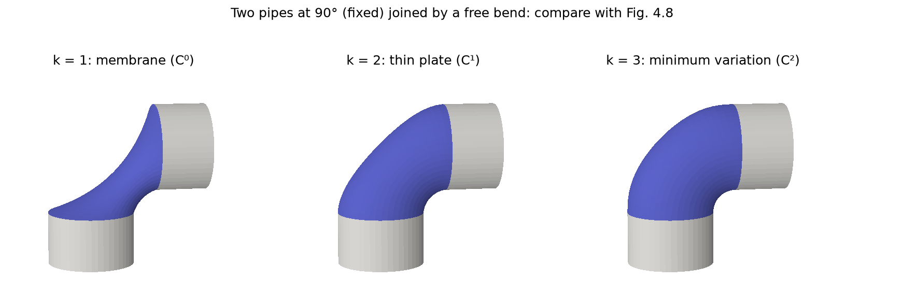
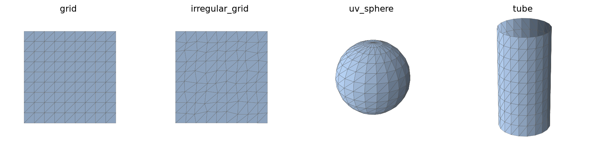
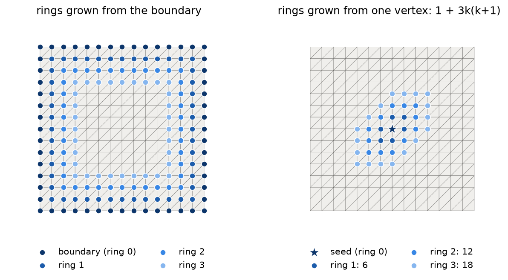

# fairing-lib

A small Python library for studying **mesh smoothing and fairing** as presented in *Polygon Mesh Processing* by Botsch, Kobbelt, Pauly, Alliez and Lévy (A K Peters, 2010), Chapters 3–4 and Appendix A. The book is not included: this repository cites it only by section, equation and figure number.

- [PLAN.md](PLAN.md): the roadmap, one GitHub issue per step.
- [docs/PROGRESS.md](docs/PROGRESS.md): the current status, the design decisions and the pitfalls found so far.
- [docs/phases/](docs/phases/): one study note per phase, mapping each equation to the code that implements it (see [Study notes](#study-notes)).



*Two fixed pipes (gray) joined by a free bend (purple), faired with k = 1, 2 and 3, the setting of the book's Fig. 4.8. The k = 1 membrane kinks at the joints, while k = 2 and 3 join the pipes smoothly.*

## What is fairing?

A triangle mesh stores a surface as vertex positions `V` and triangles `F`. Chapter 4 of the book asks two related questions:
- **Smoothing:** the mesh is noisy. How do we remove the bumps but keep the shape?
- **Fairing:** some vertices are fixed, such as two pipes or the rim of a hole. What is the smoothest surface in between that fits them?

Both are answered with one sparse matrix: the **discrete Laplace–Beltrami operator** `L`, stored as `L = D·M` (App. A.1). At each vertex, `Lx` points from the vertex toward a weighted average of its neighbors. The weights can be **uniform** (Eq. 3.10), which only looks at the connectivity, or **cotangent** (Eq. 3.11), which follows the geometry. With cotangent weights, `Lx` approximates the mean curvature normal, `Δx = −2H·n` (Eq. 3.7).

- **Smoothing is a flow.** Vertices move along `Lx`, as heat diffuses: `∂x/∂t = λLx` (Eq. 4.5–4.6). Explicit time steps are cheap, but they must be small enough. The book uses implicit steps for large steps (§4.2): they solve a sparse linear system, and Phase 3 shows they are stable for any step size.
- **Fairing jumps to where such a flow ends.** It asks for `Lᵏx = 0` at the free vertices (§4.3): a **membrane** for k = 1, a **thin plate** for k = 2 and a **minimum variation surface** for k = 3. These fair surfaces are the steady states of the kth-order flow `∂x/∂t = Δᵏx` (p. 60–61). With k rings of vertices fixed around the free region, the order k sets the smoothness at the joint, up to C^(k−1) (Fig. 4.8): the k = 1 membrane can kink, the thin plate joins the fixed part tangentially, and k = 3 matches its curvature too, as in the figure above. Each solve is one sparse symmetric positive definite system (Eq. A.2), which we factorize with sparse Cholesky (§A.4).

These are the book's **linear** methods: the weights are computed once from the input mesh and then frozen. That is why each solve is a single linear system, but it also means the result can depend on the mesh. Uniform weights depend on the sampling, and cotangent weights on where the free vertices start. The phase notes measure both effects.

## Install

**1. SuiteSparse (once per machine).** The fairing solver uses a sparse Cholesky factorization from [CHOLMOD](https://github.com/DrTimothyAldenDavis/SuiteSparse), through the Python package `scikit-sparse`. It has no prebuilt wheels, so pip compiles it against the SuiteSparse C library, which must be installed first.

- macOS (Homebrew):

  ```bash
  brew install suite-sparse
  ```

- Ubuntu / Debian:

  ```bash
  sudo apt-get install libsuitesparse-dev
  ```

**2. The package, in a virtual environment** (Python 3.11 or newer):

```bash
python3.11 -m venv .venv
source .venv/bin/activate
```

On macOS, tell the build where Homebrew put SuiteSparse. The last line works around a Command Line Tools glitch where `clang++` cannot find the standard C++ headers (`fatal error: 'complex' file not found`):

```bash
export SUITESPARSE_INCLUDE_DIR="$(brew --prefix suite-sparse)/include/suitesparse"
export SUITESPARSE_LIBRARY_DIR="$(brew --prefix suite-sparse)/lib"
export CPLUS_INCLUDE_PATH="$(xcrun --show-sdk-path)/usr/include/c++/v1"
```

On Linux these are not needed. Then install the package with the extras you need, and run the tests:

```bash
pip install -e ".[dev,mesh,viewer]"
pytest
```

| Extra | Installs | Needed for |
|---|---|---|
| `dev` | `pytest` | the tests |
| `mesh` | `trimesh` | reading the Stanford bunny (Phase 5) and the `load_mesh` test |
| `viewer` | `polyscope` | the interactive viewers (optional; never used by the tests) |

## Quick start

Fair the bend between two pipes (the setting of Fig. 4.8) with k = 1, 2 and 3:

```python
import matplotlib.pyplot as plt
from fairing import mesh, viz
from fairing.fairing import solve_fair

V, F, bend = mesh.pipe_elbow()                           # two fixed pipes and a free bend (Fig. 4.8)
faired = [solve_fair(V, F, bend, k) for k in (1, 2, 3)]  # L^k x = 0 on the bend, cotangent weights
viz.compare([(W, F) for W in faired], ["k = 1", "k = 2", "k = 3"], views=[(10, -100)] * 3)
plt.show()
```

Meshes are plain NumPy arrays: `V` is `(n, 3)` float and `F` is `(m, 3)` int. Every operator takes `laplacian="uniform"` or `laplacian="cotan"`, and the free or fixed vertices are boolean masks of length `n`.

| Module | Main functions | Book |
|---|---|---|
| `fairing.mesh` | generators `grid`, `irregular_grid`, `graded_grid`, `uv_sphere`, `irregular_sphere`, `tube`, `pipe_elbow`; I/O `load_obj`, `save_obj`, `load_mesh`; connectivity `edges`, `adjacency`, `one_rings`, `boundary_vertices`, `edge_face_counts`, `ring_distance`, `k_ring`; damage `add_noise`, `flatten_onto_border_plane` | §3.3.1, §4.3 (k rings) |
| `fairing.laplacian` | `uniform_laplacian` and `cotan_laplacian`, which return `L, D, M` with `L = D @ M`; `vertex_areas`; `mean_curvature` | Eq. 3.7, 3.10, 3.11, 3.13; App. A.1 |
| `fairing.smoothing` | `explicit_smoothing`, `explicit_step_limit`, `implicit_smoothing`, `roughness` | §4.2; App. A.1 |
| `fairing.fairing` | `fairing_matrix`, `solve_fair` | §4.3; Eq. A.2; §A.4 |
| `fairing.viz` | `plot_mesh`, `compare`, `show_polyscope` | — |

## Reproduce every figure

Every PNG in `docs/img/` is written by one of seven scripts. Run them from the repository root, inside `.venv`:

| Script | Figures | Phase note | Needs |
|---|---|---|---|
| `python examples/01_meshes.py` | `03-meshes.png`, `04-rings.png` | [phase 1](docs/phases/phase-1.md) | — |
| `python examples/02_laplacian.py` | `05-uniform-Lx.png`, `06-uniform-vs-cotan.png`, `06-sphere-H.png` | [phase 2](docs/phases/phase-2.md) | — |
| `python examples/03_smoothing.py` | `07-explicit-iters.png`, `07-explicit-unstable.png`, `08-implicit-large-h.png`, `08-uniform-vs-cotan-shapes.png` | [phase 3](docs/phases/phase-3.md) | — |
| `python examples/04_fairing.py` | `09-sparsity.png`, `10-membrane.png`, `10-two-membranes.png`, `11-tube-k123.png`, `11-profile.png`, `11-elbow-k123.png`, `11-elbow-profiles.png`, `11-elbow-weights.png`, `12-uniform-vs-cotan-fairing.png`, `13-flow-to-fair.png` | [phase 4](docs/phases/phase-4.md) | — |
| `python examples/04_readme_elbow.py` | `11-elbow-k123-readme.png` | README opening image | run after `04_fairing.py`; crops its first row without resampling |
| `python examples/05_bunny.py` | `14-bunny-before-after.png` | [phase 5](docs/phases/phase-5.md) | the bunny download and `.[mesh]` |
| `python examples/05_bunny_book_region.py` | `14-bunny-book-region.png` | [phase 5](docs/phases/phase-5.md) | the bunny download and `.[mesh]` |

The scripts overwrite the committed PNGs, and the bunny scripts also print the numbers quoted in the phase-5 note. Together they take about 15 seconds. To check the result, run `git status docs/img`. From a clean checkout, with Python 3.11.11, numpy 2.4.6, scipy 1.17.1, matplotlib 3.11.2, scikit-sparse 0.5.0 and trimesh 5.1.1, all 21 PNGs came out byte-identical to the committed ones, so `git status` showed no change. With other versions, the images may differ slightly, so compare them by eye.

## Gallery

Each figure is explained in its phase note, under the issue number given here.

### Phase 1: Foundations ([note](docs/phases/phase-1.md))

| Figure | What it shows |
|---|---|
|  | **#3.** The four synthetic meshes: a regular grid, an irregular grid with the same connectivity but shifted interior vertices, a UV sphere and an open tube. |
|  | **#4.** Left: the fixed rings grown outward from a free disk, the setup of fairing. Right: the k-rings around one vertex, with 1 + 3k(k+1) vertices. |

### Phase 2: Discrete Laplace–Beltrami, Ch. 3 ([note](docs/phases/phase-2.md))

| Figure | What it shows |
|---|---|
|  | **#5.** The uniform ‖Lx‖ on flat grids: zero on the regular grid, but non-zero on the irregular one although it is flat. The Lx vectors lie in the plane. |
|  | **#6.** On the same flat, irregular grid, the uniform ‖Lx‖ is non-zero, while the cotangent ‖Lx‖ is zero: linear precision. |
|  | **#6.** The cotangent H·R on a sphere is close to 1, and its error falls like h², except at the poles, where barycentric areas give ¾ of the true value. |

### Phase 3: Diffusion flow, §4.2 ([note](docs/phases/phase-3.md))

| Figure | What it shows |
|---|---|
|  | **#7.** Explicit smoothing of a noisy sphere. Uniform weights remove the noise quickly but shrink and distort the sphere; the cotangent flow's stable step is about 45 000× smaller. |
|  | **#7.** Above the step limit h_max, a zig-zag pattern grows by ×1.2 per step and tears the mesh into spikes. |
|  | **#8.** One step 338× above h_max: the explicit step explodes, while the implicit step removes most of the noise. |
|  | **#8.** The idea of Fig. 4.6: the uniform flow slides vertices along the sphere and regularizes the triangles, while the cotangent flow keeps their shapes. |

### Phase 4: Fairing, §4.3 and App. A ([note](docs/phases/phase-4.md))

| Figure | What it shows |
|---|---|
|  | **#9.** The fairing matrix for k = 1, 2, 3 stays sparse: 7, 19 and 37 non-zeros per interior row, the k-ring sizes. |
|  | **#10.** Membranes (k = 1): with a flat boundary the result is exactly flat; with a saddle-shaped boundary it is a smooth saddle. |
|  | **#10.** Two membranes: uniform weights converge to the harmonic graph of Eq. 4.8, while cotangent weights from a smooth start approach a minimal surface, H → 0 (Eq. 4.7). |
|  | **#11.** A tube blend for k = 1, 2, 3, colored by mean curvature: a kink at the joints for k = 1, smooth joints for k = 2 and 3. |
|  | **#11.** One meridian of the tube blend: k = 1 meets the fixed bands at an angle, while k = 2 and 3 leave them tangentially. |
|  | **#11.** The setting of Fig. 4.8: two fixed pipes at 90° joined by a free bend, for k = 1, 2, 3. |
|  | **#11.** With cotangent weights, the k = 3 elbow depends on where the bend starts. With uniform weights it does not, but its compressed inner side folds. |
|  | **#11.** Weights frozen from a straight tube instead of the bent start make the inner side of the bend fold into a crease. |
|  | **#12.** The idea of Fig. 4.9: a thin plate on a mesh of varying density. Uniform weights create bumps where dense bands cross the free disk; cotangent weights reproduce the exact saddle. |
|  | **#13.** Fairing as the limit of the flow (p. 61): one implicit step approaches the fair surface like 1/h, and explicit steps (damped Jacobi iterations) converge to it. |

### Phase 5: A real mesh ([note](docs/phases/phase-5.md))

| Figure | What it shows |
|---|---|
|  | **#14.** A damaged region of the Stanford bunny refilled with a thin plate. The uniform refill ignores how the region starts; the cotangent refill inherits it. |
|  | **#14.** A hole like the one in Fig. 4.7, on the full-resolution bunny, filled with a smooth thin-plate patch. |

## Study notes

The phase notes are written for a student who has read the chapter but not the code. For each issue, they map every equation to the function and line that implements it (**Theory → code**), explain the figures (**What the figures show**), and list what went wrong or surprised us (**Pitfalls**).

| Note | Book | Issues |
|---|---|---|
| [Phase 1: Foundations](docs/phases/phase-1.md) | §3.3.1 (one-rings) | #1 setup, #2 meshes and OBJ I/O, #3 plots, #4 k-rings |
| [Phase 2: Discrete Laplace–Beltrami](docs/phases/phase-2.md) | Eq. 3.7, 3.10, 3.11, 3.13; App. A.1 | #5 uniform, #6 cotangent |
| [Phase 3: Diffusion flow](docs/phases/phase-3.md) | §4.2, Eq. 4.5–4.6; App. A.1 | #7 explicit, #8 implicit |
| [Phase 4: Fairing](docs/phases/phase-4.md) | §4.3, Eq. 4.7–4.9, Fig. 4.8–4.9; App. A | #9 solver, #10 membrane, #11 thin plate and minimum variation, #12 uniform vs cotangent, #13 the limit of the flow |
| [Phase 5: A real mesh](docs/phases/phase-5.md) | §4.3, Fig. 4.7 | #14 bunny hole filling |

## The Stanford bunny

Phase 5 uses the Stanford Bunny from the [Stanford 3D Scanning Repository](https://graphics.stanford.edu/data/3Dscanrep/) (Stanford Computer Graphics Laboratory). It is **not** included in this repository. The repository allows using and redistributing it for free for research, with credit to the Stanford Computer Graphics Laboratory, but not for commercial use. Download it into the git-ignored `data/` folder:

```bash
mkdir -p data
curl -L -o data/bunny.tar.gz https://graphics.stanford.edu/pub/3Dscanrep/bunny.tar.gz
tar -xzf data/bunny.tar.gz -C data bunny/reconstruction
```

The examples read the bunny with `trimesh`. `examples/05_bunny.py` uses `data/bunny/reconstruction/bun_zipper_res2.ply` (a decimated version with about 8k vertices). `examples/05_bunny_book_region.py`, a hole like the book's Fig. 4.7, uses the full-resolution `bun_zipper.ply` (about 35k vertices) from the same download:

```bash
pip install -e ".[mesh]"
python examples/05_bunny.py
python examples/05_bunny_book_region.py
```

The tests do not need the download: the two tests that use the bunny are skipped when the files are missing. The test of `load_mesh` needs `trimesh` and is skipped without the `mesh` extra.

## Viewing meshes interactively with polyscope

The figures in `docs/img/` are static matplotlib PNGs. To rotate, zoom, and inspect a mesh, use [polyscope](https://polyscope.run/py/), an optional viewer. It also lights colored surfaces, so their shape stays readable, which matplotlib cannot do.

**1. Install it** (once, inside `.venv`):

```bash
pip install -e ".[viewer]"
```

**2. Run an example.** Each one opens a window; close it, or press `Esc`, to return to the terminal.

| Script | What it shows |
|---|---|
| `python examples/01_polyscope_one_mesh.py` | the UV sphere colored by its height `z` |
| `python examples/01_polyscope_all_meshes.py` | the four synthetic meshes side by side, with edges |
| `python examples/04_polyscope_elbow.py` | the two-pipe elbow of Fig. 4.8: start and results for k = 1, 2, 3 (fixed gray, free blue), smoothly shaded |
| `python examples/04_polyscope_fig49.py` | Fig. 4.9 setting (#12): graded mesh, exact surface, uniform and cotangent thin plates, with curvature, error and sideways-slide quantities |
| `python examples/05_polyscope_bunny.py` | the Stanford bunny (#14): original, damaged inputs and thin-plate refills, with free region and curvature quantities (needs the download above) |
| `python examples/05_polyscope_bunny_explorer.py` | **interactive explorer** on the bunny: a panel to change the region size, the damage, the order k and the weights; the refill is re-solved at once, with curvature colors, a ghost of the original and live numbers (needs the download above) |
| `python examples/05_polyscope_bunny_book.py` | a hole like the book's Fig. 4.7 on the full-resolution bunny, seen from the book's angle: a panel to show the hole, the damaged input, the refill or the original, and to change the radius, the damage, k and the weights (needs the download above) |

**3. In the window:** drag with the left mouse button to rotate, drag with the right button to pan, and scroll to zoom. The left panel lists the meshes: use the checkboxes to show or hide them, and open a mesh's entry to change its color, edges, or scalar colormap.

**4. In your own code**, `viz.show_polyscope` opens any mesh, optionally colored by one value per vertex:

```python
from fairing import mesh, viz

V, F = mesh.uv_sphere(16, 24)
viz.show_polyscope(V, F, scalars=V[:, 2])   # scalars: one value per vertex, or None
```

To show several meshes in one window, call polyscope directly, as `examples/01_polyscope_all_meshes.py` does: `ps.init()`, then `ps.register_surface_mesh(name, V, F)` for each mesh, then `ps.show()`.

**Example: refill a region of the bunny and look at it.** After downloading the bunny (above):

```python
import numpy as np
from fairing import mesh, viz
from fairing.fairing import solve_fair

V, F = mesh.load_mesh("data/bunny/reconstruction/bun_zipper_res2.ply")
free = np.zeros(len(V), dtype=bool)
free[mesh.k_ring(F, [3649], 6, n=len(V))] = True      # a 6-ring region on the bunny's side
damaged = mesh.flatten_onto_border_plane(V, F, free)   # crude patch, to be refilled
W = solve_fair(damaged, F, free, 2)                    # thin plate, cotangent weights
viz.show_polyscope(W, F, scalars=free.astype(float))   # the refilled region in color
```

polyscope is never needed by the tests or by CI.

## Credits

- The book: M. Botsch, L. Kobbelt, M. Pauly, P. Alliez and B. Lévy, *Polygon Mesh Processing*, A K Peters, 2010. Phase 4 also consults M. Botsch and L. Kobbelt, "An Intuitive Framework for Real-Time Freeform Modeling" (2004), the paper behind Fig. 4.8.
- The Stanford Bunny: Stanford Computer Graphics Laboratory, [Stanford 3D Scanning Repository](https://graphics.stanford.edu/data/3Dscanrep/).
