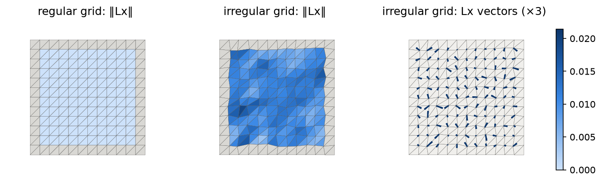
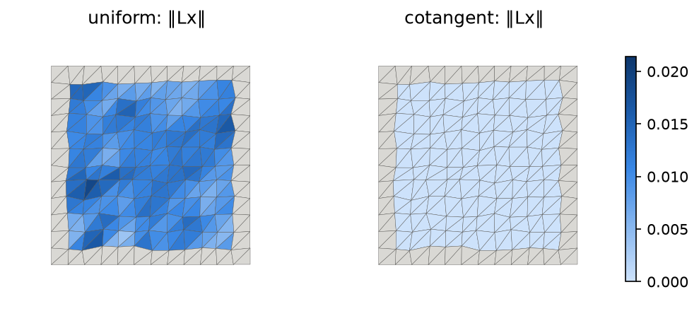
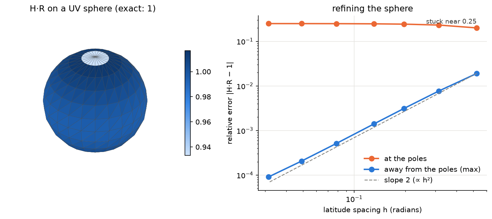

# Phase 2 — Discrete Laplace–Beltrami (Ch. 3)

Everything in Chapter 4 and Appendix A rests on one matrix: a discrete version of the Laplace–Beltrami operator Δ. Applied to the vertex positions it should give the mean curvature normal, Δx = −2H·n (Eq. 3.7). This phase builds two discretizations and tests them against that promise.

Both share the form of App. A.1:

  Δf(vᵢ) = wᵢ · Σⱼ wᵢⱼ (fⱼ − fᵢ),  stored as **L = D·M**,

with D = diag(wᵢ) (per-vertex normalization) and M symmetric (mᵢⱼ = wᵢⱼ on edges, mᵢᵢ = −Σⱼ wᵢⱼ). Each row of M sums to 0, so a constant function has zero Laplacian. M stays symmetric even though L is not, which the solvers of Phases 3–4 rely on.

## #5 Uniform Laplacian

**Theory → code.** With wᵢⱼ = 1 and wᵢ = 1/deg(vᵢ), Eq. 3.10 becomes Δxᵢ = (centroid of the neighbors) − xᵢ. The operator only looks at connectivity.

| Book | Formula | Code |
|---|---|---|
| Eq. 3.10, §4.1.2 | wᵢⱼ = 1 on every edge | `fairing/laplacian.py:37` |
| Eq. 3.10 | deg(vᵢ) = \|N₁(vᵢ)\| | `laplacian.py:38` |
| App. A.1 | M = W − diag(Σⱼ wᵢⱼ) | `laplacian.py:39` |
| App. A.1 | D = diag(1/deg) | `laplacian.py:40` |
| App. A.1 | L = D·M | `laplacian.py:41` |

Tests (`tests/test_laplacian.py`): M is symmetric with zero row sums, L = D @ M, and (Lx)ᵢ equals the neighbor centroid minus xᵢ. ‖Lx‖ = 0 at the interior of the regular grid, while on the irregular grid it is non-zero at every interior vertex and purely in-plane.

**What the figures show.**

`docs/img/05-uniform-Lx.png` shows three views of flat grids, from above. Left: on the regular grid, ‖Lx‖ = 0 at every interior vertex, because each neighbor has a mirror partner. Middle: on the irregular grid, same scale, ‖Lx‖ reaches about 25% of the grid spacing, although the surface is perfectly flat and its mean curvature is 0. Right: the Lx vectors (×3) themselves. They lie *in* the plane and point to each vertex's neighbor centroid, so this "curvature" is pure tangential error. Gray faces touch the boundary, where Lx is excluded (see Pitfalls).

**Pitfalls.**
- *The boundary is always "wrong".* A boundary vertex has all its neighbors on one side, so even on the regular grid its Lx points inward with length about h/2. Including it would swamp the color scale, so figures mark boundary values as NaN (gray).
- *The uniform Lx is not a curvature estimate.* It has units of length, not 1/length. On irregular grids with fixed relative jitter, mean ‖Lx‖ ≈ 0.12·h at every resolution (0.0106, 0.0050, 0.0026 for h = 1/12, 1/24, 1/48). On the unit sphere it gives ‖Lx‖ ≈ 0.004 where 2H = 2. The missing piece is the division by an area, which the cotangent version adds in #6.
- *"Zero on the regular grid" depends on symmetry, not on flatness.* It holds because every neighbor has a mirror partner. The irregular grid is just as flat but loses that symmetry.

## #6 Cotangent Laplacian

**Theory → code.** Eq. 3.11 comes from integrating Δf over a small cell Aᵢ around vᵢ and turning that into a boundary integral (divergence theorem). For a piecewise linear f, the boundary integral reduces to cotangents of the angles opposite each edge (Fig. 3.10). Two things change compared with #5:
- the **edge weights** wᵢⱼ = cot αᵢⱼ + cot βᵢⱼ depend on the triangle shapes, so the operator sees the geometry;
- the **normalization** wᵢ = 1/(2Aᵢ) divides by an area, so Lx has units of 1/length, like curvature.

| Book | Formula | Code |
|---|---|---|
| Fig. 3.10 | cot of the angle at k, opposite edge (i, j): (u·v)/‖u×v‖ | `fairing/laplacian.py:78` |
| Eq. 3.11 | wᵢⱼ = cot αᵢⱼ + cot βᵢⱼ (each triangle adds one cotangent) | `laplacian.py:82` |
| App. A.1 | mᵢᵢ = −Σⱼ wᵢⱼ | `laplacian.py:85` |
| Fig. 3.7 | barycentric area Aᵢ = ⅓ Σ (incident triangle areas) | `vertex_areas`, `laplacian.py:50` |
| Eq. 3.11, App. A.1 | D = diag(1/(2Aᵢ)) | `laplacian.py:86` |
| Eq. 3.7, 3.13 | H = ½‖Lx‖ | `mean_curvature`, `laplacian.py:101` |

Tests (`tests/test_laplacian.py`): M is symmetric with zero row sums, and Σ Aᵢ equals the total area. On a grid of right isosceles triangles, axis edges get weight 2 (two 45° angles) and diagonals get 0 (two 90° angles). Linear precision: Lf = 0 at interior vertices for every linear f, so Lx = 0 on the flat irregular grid. On spheres, H → 1/R away from the poles, and Lx points inward (Δx = −2H·n).

**What the figures show.**

`docs/img/06-uniform-vs-cotan.png`: the same flat, irregular grid, same color scale. The uniform ‖Lx‖ is non-zero everywhere inside, while the cotangent ‖Lx‖ is zero to machine precision (below 1e-10): that is linear precision. The two operators have different units (length vs 1/length), so the shared scale is only valid because the correct answer here is 0, and zero is zero in any unit: the figure compares zero vs non-zero, not magnitudes.

`docs/img/06-sphere-H.png`, left: H·R on a sphere of radius R = 2 (exact value 1). Everything is close to 1 except the cap around the pole. Faces average their three vertices, so the pole's value of 0.75 appears diluted to about 0.93. Right: the relative error as the sphere is refined. Away from the poles it falls like h² (parallel to the dashed slope-2 line). At the poles it stays near 0.25 no matter how fine the mesh.

**Pitfalls.**
- *Barycentric areas break at fan-shaped vertices.* A UV-sphere pole is the apex of n thin triangles. Its barycentric cell is ⅓ of the fan, about πρ²/3, where ρ is the edge length to the first ring. Its Voronoi cell, which is what the derivation of Eq. 3.11 integrates over, is about πρ²/4. The ratio 4/3 makes H = ¾·(1/R), and refining does not help, because the shape of the fan stays the same. The cotangent weights in M are fine; only D is off. The mixed Voronoi area of moonshot M1 (#16, optional and not implemented) is meant to fix exactly this.
- *Face colors hide single-vertex outliers.* `plot_mesh` colors a face by the mean of its vertices, so a bad value at one vertex is diluted by its neighbors. For a quantitative claim, plot numbers (as in the convergence plot), not colors.
- *Cotangent weights can be negative.* cot α + cot β < 0 when α + β > π (§3.3.4). Our test meshes stay far from that, but strongly obtuse triangles (e.g. heavy jitter) would trigger it.
- *Units differ between the two Laplacians.* The uniform Lx is a length; the cotangent Lx is a curvature (1/length). A shared color scale can therefore only show **zero vs non-zero**, as in `06-uniform-vs-cotan.png`, where the correct answer is 0. When both are non-zero (e.g. on a sphere), their magnitudes are not comparable: scaling the mesh by 10 multiplies the uniform values by 10 and divides the cotangent values by 10.
