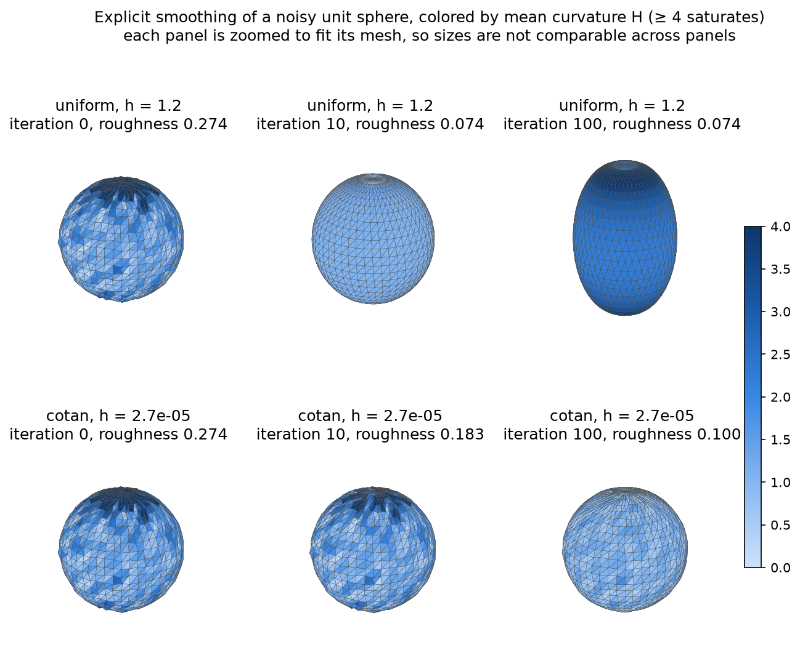
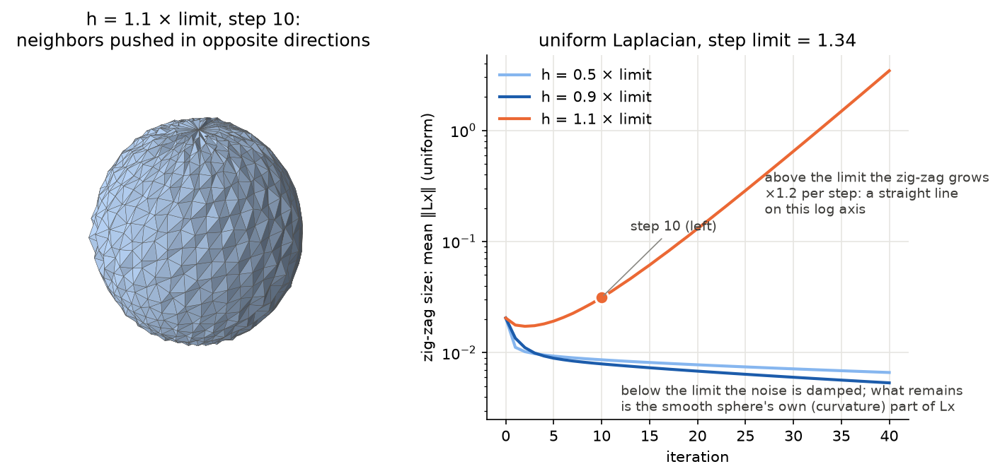
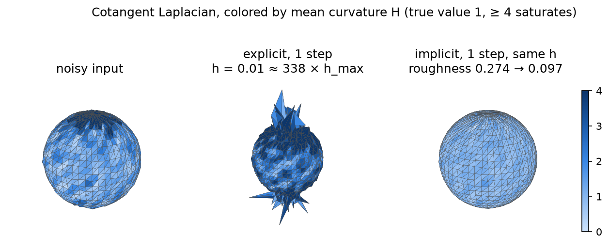
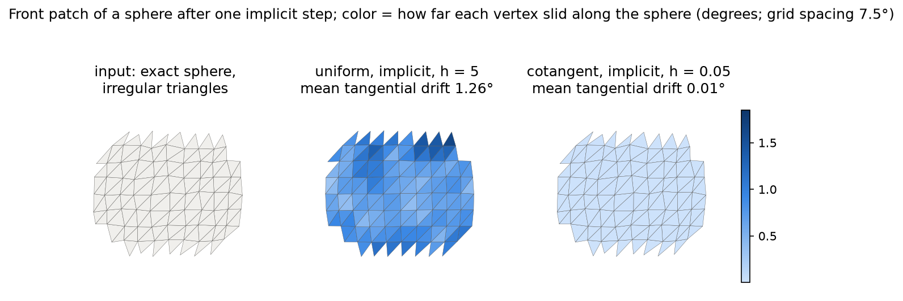

# Phase 3 — Diffusion flow (§4.2)

Smoothing treats the vertex positions like heat: the diffusion equation ∂f/∂t = λΔf (Eq. 4.5) evens out high-frequency bumps. Discretizing Δ with a Laplace matrix gives one ODE per vertex, ∂x/∂t = λLx (Eq. 4.6). Discretizing time with steps h gives an update rule. With the cotangent Laplacian, Lx ≈ −2H·n (Eq. 3.7), so each vertex moves along its normal by an amount proportional to its mean curvature: this is *mean curvature flow*.

## #7 Explicit Laplacian smoothing

**Theory → code.** Explicit Euler evaluates the right-hand side at the current time: x ← x + hλ·Lx (§4.2, p. 55–56). The book only warns that "a sufficiently small time step h has to be chosen". This section works out how small: the largest safe step, which we call **h_max**.

### The step limit h_max

**Intuition: overshooting.** Each step pulls every vertex toward where its neighbors want it to be. A small step moves it part of the way. A step that is too large overshoots: the vertex lands on the other side, farther away than it started. The next step overshoots back, even farther, and so on. The error flips sign and grows every step. h_max is the largest step that never overshoots like this.

**A hand-computable example.** Take the uniform Laplacian (Lx = neighbor centroid − x) and a perfect *zig-zag*: every vertex is at height +a and all its neighbors are at −a, or the other way round. For a vertex at +a, the centroid of its neighbors is −a, so (Lx)ᵢ = −a − a = −2a. One step gives

  a ← a + hλ·(−2a) = (1 − 2hλ)·a.

- hλ = 0.25: a is multiplied by 0.5 → it shrinks (stable).
- hλ = 1: multiplied by −1 → same size, opposite sign (on the edge).
- hλ = 1.1: multiplied by −1.2 → it flips and grows by 20% every step (unstable).

So for this pattern h_max = 1/λ. The factor −2 here is an *eigenvalue* of L: the zig-zag is a pattern that L just rescales, Lx = μ·x with μ = −2.

**The general rule.** Any configuration of the mesh is a mix of such patterns, the eigenvectors of L, each with its own eigenvalue μ ≤ 0. Smooth, slowly varying patterns have μ close to 0; fast-oscillating ones have very negative μ. One explicit step multiplies the amount of each pattern by **(1 + hλμ)**. Everything stays bounded only if |1 + hλμ| ≤ 1 for *every* μ. The hardest pattern is the one with the most negative eigenvalue, μ_min, so

  **h_max = 2 / (λ·|μ_min|)**.

With h = 1.1·h_max, that pattern is multiplied by 1 − 1.1·2 = −1.2 per step: this is the ×1.2 growth, with alternating sign, seen in `07-explicit-unstable.png`.

**How the code computes it** (`explicit_step_limit`, `fairing/smoothing.py:58–60`). We need only one number, the most negative eigenvalue of L. Two details:
- L = D·M is not symmetric, but S = D^½·M·D^½ is, and it has the same eigenvalues, since S = D^−½·L·D^½ is the same operator written in rescaled coordinates. Symmetric matrices have real eigenvalues and fast dedicated solvers.
- All eigenvalues are ≤ 0, so the most negative one is the one with the largest magnitude. `scipy.sparse.linalg.eigsh(S, k=1, which="LM")` finds just that one, without computing the others.

A test checks the result against a full dense eigenvalue computation.

**Typical values** (the noisy 24 × 48 sphere of the figures):

| Laplacian | μ_min | h_max (λ = 1) | why |
|---|---|---|---|
| uniform | −1.49 | 1.34 | μ_min ≥ −2 always. A perfect zig-zag (μ = −2) is impossible on a triangle mesh, because around a triangle the signs cannot alternate, so h_max is a bit above 1. |
| cotangent | −6.8·10⁴ | 3.0·10⁻⁵ | Weights are divided by vertex areas, so μ scales like 1/(edge length)². The tiny, thin triangles at the poles set μ_min for the whole mesh. |

A step of hλ = 1 with the uniform Laplacian moves every vertex exactly onto its neighbors' centroid (a test checks this). The cotangent h_max is about 45 000× smaller, which is why explicit cotangent smoothing is so slow.

| Book | Formula | Code |
|---|---|---|
| §4.2, Eq. 4.6 | x ← x + hλ·Lx, L rebuilt from the current x | `explicit_smoothing`, `fairing/smoothing.py:39` |
| §4.2 ("sufficiently small h") | h_max = 2/(λ\|μ_min\|), μ_min from the symmetric D^½MD^½ | `explicit_step_limit`, `smoothing.py:58–60` |
| — | noise measure: mean angle between adjacent face normals | `roughness`, `smoothing.py:103` |

Tests (`tests/test_smoothing.py`): h_max matches a dense eigenvalue computation; at hλ = 1 the uniform step lands on the centroid; smoothing removes most of the noise's excess roughness with either Laplacian; 0.95 × h_max stays bounded for 300 steps, while 1.05 × h_max grows past 10³.

**What the figures show.**

`docs/img/07-explicit-iters.png`: a noisy unit sphere (σ = 0.01) smoothed at 0.9 × each operator's h_max, colored by H (true value 1).
- **Uniform (top),** h = 1.2: the noise is gone after 10 steps (roughness 0.274 → 0.074, the clean sphere's own value). By step 100 the sphere has shrunk to 0.61 × 0.61 × 0.93, from 2 × 2 × 2, and is no longer round.
- **Cotangent (bottom),** h = 2.7·10⁻⁵: the stable step is about 45 000× smaller. After 100 steps the noise is only partly removed (roughness 0.100), and the radius has barely changed (0.994).

Each panel is zoomed to fit its mesh, so shrinking is visible only in the numbers.

`docs/img/07-explicit-unstable.png`, right: the size of the zig-zag part of the mesh, measured as the mean uniform ‖Lx‖ (how far vertices sit from their neighbors' centroid), over 40 steps on a log axis.
- **0.5× and 0.9× h_max:** the noise is damped within a few steps. What remains (≈ 0.006) is the smooth sphere's own curvature part of Lx, not noise.
- **1.1× h_max:** the zig-zag pattern is multiplied by −1.2 per step. After a short dip, while the other patterns are still being damped, the curve becomes a straight line, which on a log axis means exponential growth.

Left: the mesh at the two marked steps of that run.
- **Step 10:** still a sphere, but neighboring vertices have been pushed in and out, giving a faceted zig-zag look.
- **Step 32:** the zig-zag is now larger than the sphere's edges, the vertices have been flung out, and the mesh is torn into spikes.

**Pitfalls.**
- *The cotangent flow is stiff.* Its stable step is dictated by the thinnest triangles (here the UV-sphere poles), not by the noise you want to remove. Explicit cotangent smoothing therefore needs very many tiny steps. This is the book's reason for implicit integration (#8).
- *Laplacian smoothing shrinks.* For mean curvature flow on a sphere, dr/dt = −2λH = −2λ/r, so r² = r₀² − 4λt. Our cotangent run gives exactly that (r = 0.994 after t = 0.0027). The uniform flow is not mean curvature flow: its speed depends on local edge lengths, which vary over the UV sphere. So it shrinks much faster and unevenly, and the sphere turns into an elongated shape.
- *h_max depends on the mesh.* It must be computed for each mesh (`explicit_step_limit`); a value from another mesh, even a slightly noisier one, may be unsafe. It can also drift while the mesh evolves, since L is rebuilt every step.
- *Pick the measure that sees the problem.* The first version of the blow-up figure plotted the largest coordinate. It stays flat until step ~22, although the mesh is already wrecked by then: the zig-zag is larger than an edge long before it changes the overall size. The mean ‖Lx‖ measures the zig-zag directly and shows the ×1.2 growth from the start.
- *The obvious noise measure failed.* The spread of the vertex radii *increased* under uniform smoothing, because the shape stops being a sphere even as the noise vanishes. A local measure (angles between neighboring normals) separates "noise" from "shape". On coarse meshes, compare it with the clean mesh's value, since faceting alone makes it non-zero.
- *A capped color scale.* The noisy H has a long tail (up to ~40), so the figure caps the scale at 4. Without the cap, every panel looks equally pale.

## #8 Implicit Laplacian smoothing

**Theory → code.** Implicit Euler evaluates the Laplacian at the *new* positions: x' = x + hλ·Lx', i.e. **(I − hλL) x' = x** (§4.2, p. 55). Instead of a simple update, each step now solves a sparse linear system, once for each of x, y and z.

**Why there is no h_max anymore.** Use the same eigenvector picture as for h_max (#7). For a pattern with Lx = μx, the implicit step gives x' − hλμx' = x, so x' = x / (1 − hλμ). The factor **1/(1 − hλμ)** lies between 0 and 1 for every μ ≤ 0 and every h > 0:

| pattern | μ | explicit factor 1 + hλμ | implicit factor 1/(1 − hλμ) |
|---|---|---|---|
| smooth (e.g. the sphere itself) | ≈ 0 | ≈ 1 (kept) | ≈ 1 (kept) |
| noise | very negative | can be < −1 → explodes | ≈ 0 → removed |

So a large h simply removes more of the high-frequency patterns; it never amplifies anything. Implicit Euler is "unconditionally stable".

**Making the system symmetric.** I − hλL = I − hλDM is not symmetric, because D rescales the rows. Multiplying both sides by D⁻¹ (App. A.1, the same idea as Eq. A.2) gives

  **(D⁻¹ − hλM) x' = D⁻¹x**.

M is symmetric and D⁻¹ is diagonal, so the matrix is symmetric. It is also positive definite: D⁻¹ has positive entries (the vertex degrees, or 2Aᵢ for cotan), and −M is positive semi-definite. Symmetric positive definite systems are the easy, robust kind (App. A).

| Book | Formula | Code |
|---|---|---|
| App. A.1 | D⁻¹ = diag(1/wᵢ) | `implicit_smoothing`, `fairing/smoothing.py:94` |
| §4.2, App. A.1 | build D⁻¹ − hλM, factorize it once per step | `implicit_smoothing`, `smoothing.py:95`, `:98` |
| App. A.1 | right-hand side D⁻¹x | `implicit_smoothing`, `smoothing.py:96` |
| §4.2 | solve for x', y', z' with the same factorization | `implicit_smoothing`, `smoothing.py:99` |
| Fig. 4.6 setting | exact sphere, vertices moved *along* it | `irregular_sphere`, `fairing/mesh.py:119` |

Tests (`tests/test_smoothing.py`): D⁻¹ − hλM is symmetric and passes a Cholesky factorization. The symmetric solve also satisfies the original (I − hλL)x' = x. For tiny h, implicit and explicit agree, as two first-order methods should. Far above h_max (10× for uniform, 300× for cotan) one implicit step stays bounded and removes most of the noise. On an irregular sphere, the cotangent flow changes triangle angles by < 0.5° and the uniform flow by > 5°.

**What the figures show.**

`docs/img/08-implicit-large-h.png`: the noisy sphere of #7, one cotangent step with h = 0.01, about 338 × h_max.
- **Explicit** (middle): the zig-zag patterns are multiplied by up to |1 − 338·2| ≈ 675 in a single step, and the sphere sprouts spikes.
- **Implicit** (right): the same step size removes most of the noise (roughness 0.274 → 0.097), better than 100 explicit steps did in #7.

`docs/img/08-uniform-vs-cotan-shapes.png`, the idea of Fig. 4.6: an *exact* sphere with irregular triangles (`irregular_sphere`), so the only thing smoothing can change is the size and the triangulation. The front patch is shown head-on, and color = how far each vertex slid *along* the sphere.
- **Uniform:** vertices slide by 1.26° on average (a sixth of the grid spacing), toward their neighbor centroids, and the rows straighten out: the triangulation is being regularized.
- **Cotangent:** sliding is 0.01°, and the wireframe is the input's, just slightly smaller. Its Lx points along the normal (Δx = −2H·n), so it can only shrink the sphere, never reshape the triangles.

**Pitfalls.**
- *Implicit smoothing still shrinks.* On the unit sphere, Lx ≈ −2x, so one step scales the sphere by 1/(1 + 2hλ). For h = 0.01 that predicts a radius of 0.980, and we measure 0.981. With h = 0.1 the radius drops to 0.84. Stable does not mean shape-preserving.
- *One big step is not the same as many small ones.* L is built from the mesh at the start of the step. Ten steps of h = 0.001 smooth a little better (roughness 0.085) than one step of h = 0.01 (0.097), at the same shrinking, because each small step uses an operator rebuilt from a smoother mesh.
- *Cotangent smoothing leaves tangential noise alone.* After implicit cotan smoothing the roughness levels off near 0.087, not at the clean sphere's 0.073. An exact sphere with only tangential jitter has roughness 0.088: what remains is irregular vertex *spacing*, which the cotangent flow intentionally does not change (that is the right panel above).
- *SciPy has no sparse Cholesky.* `factorized` uses a general sparse LU (SuperLU). It works on our SPD matrix, but it does not exploit the symmetry; App. A recommends sparse Cholesky for speed. **Decision:** implicit smoothing stays on this LU on purpose. The fairing solver (Phase 4) uses a real sparse Cholesky (CHOLMOD), so the two approaches can be compared; see `phase-4.md`, "Solver choice".
- *Positive definiteness needs −M ⪰ 0.* That holds for the uniform weights and for cotangent weights on reasonable meshes. Strongly obtuse triangles can make cotangent weights negative (§3.3.4), and then the guarantee can fail.
