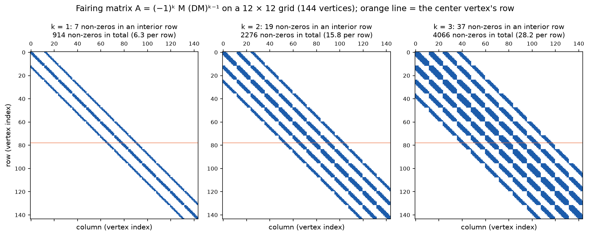
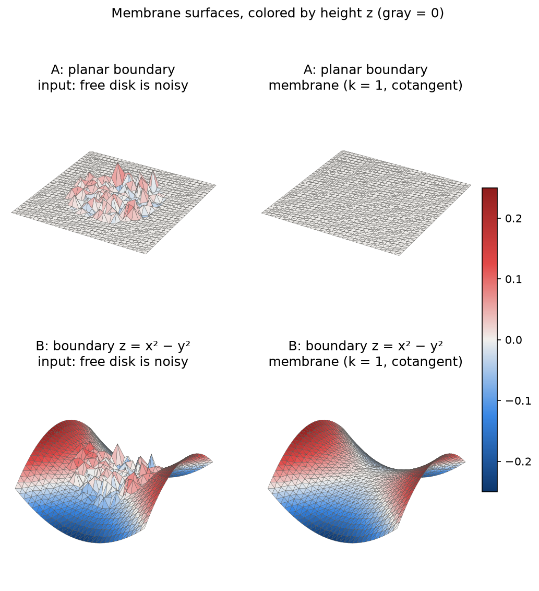
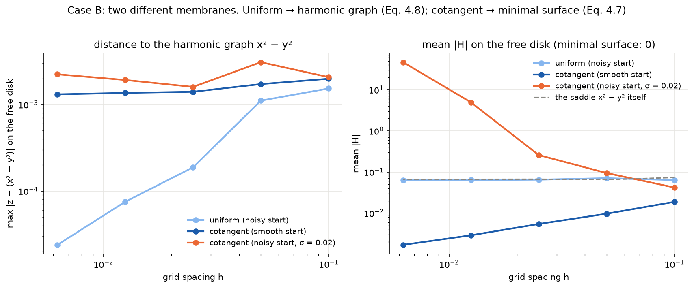
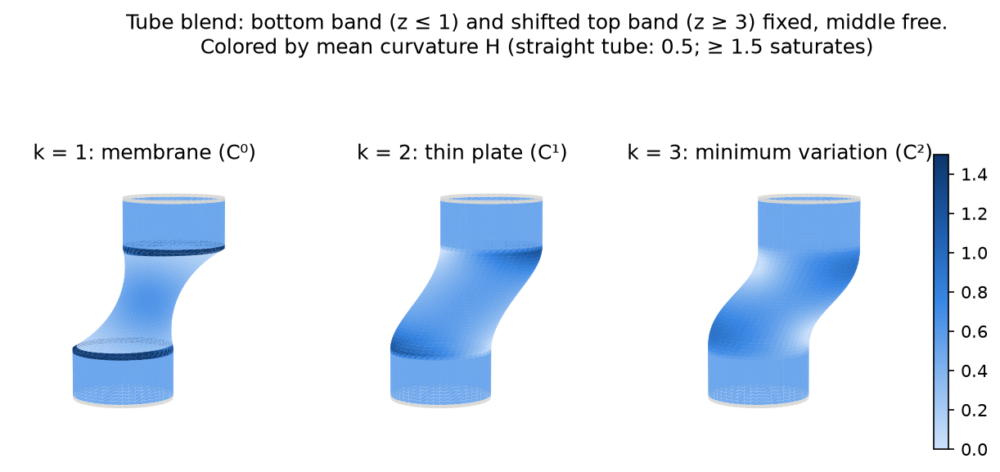
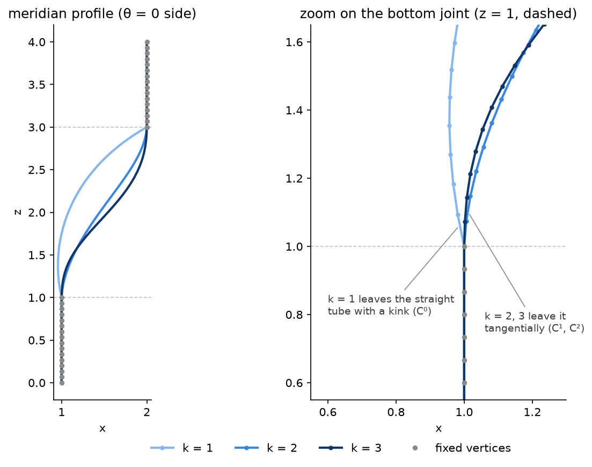
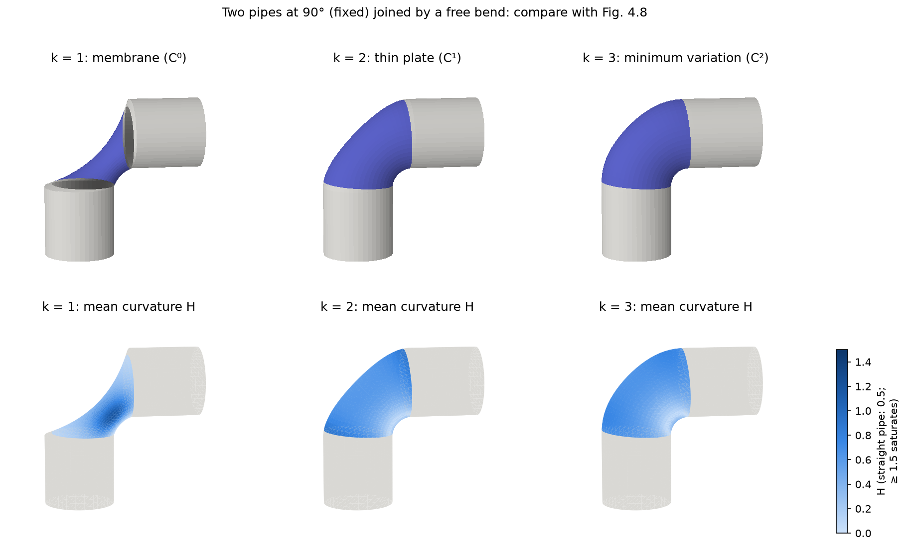
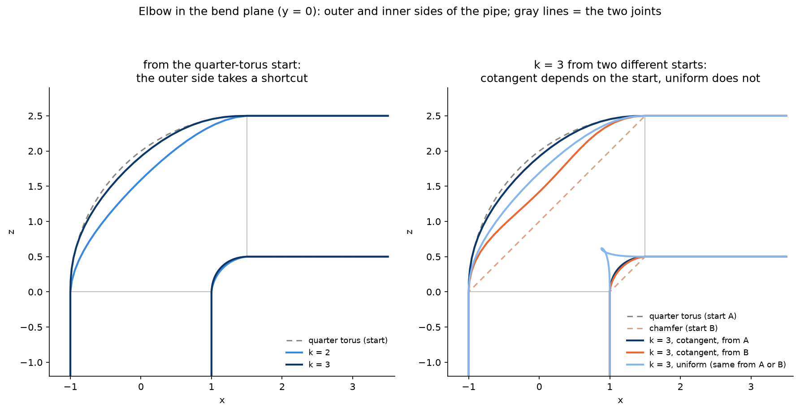
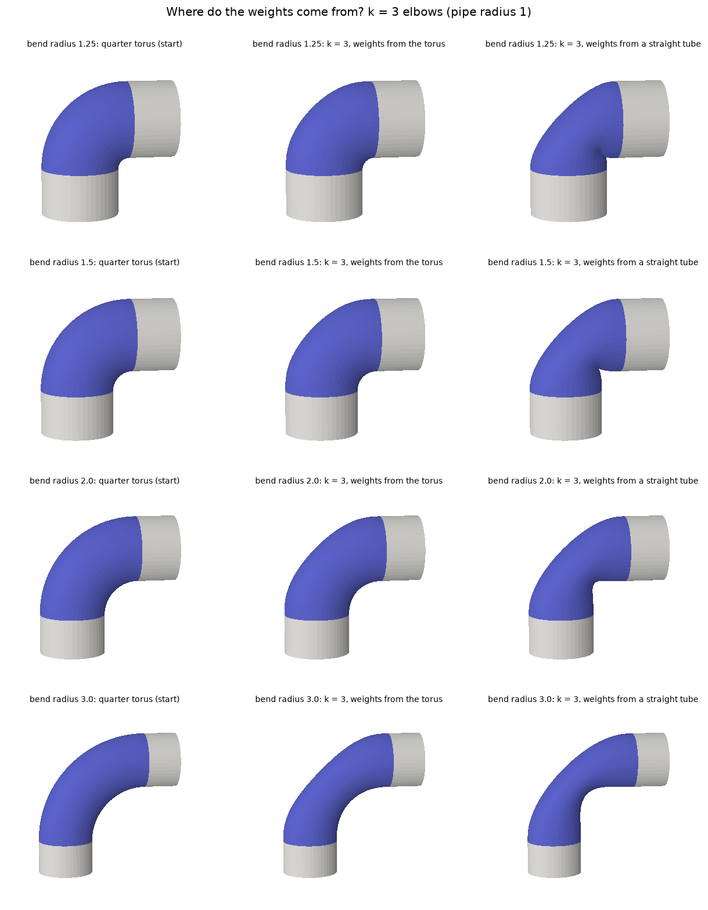
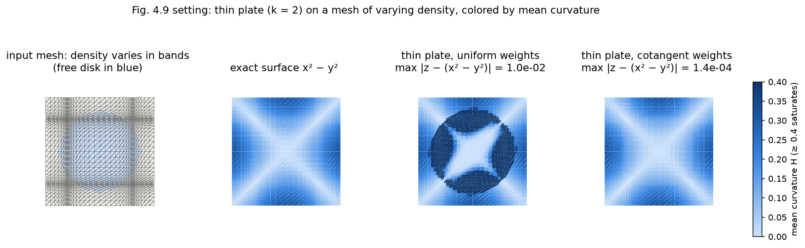
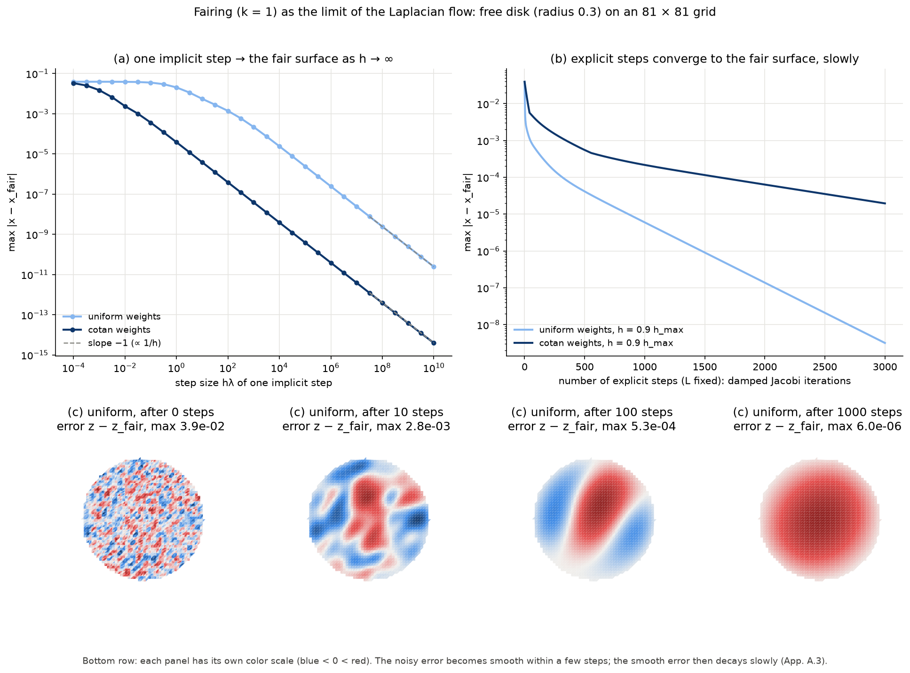

# Phase 4 — Fairing (§4.3, App. A)

Fairing computes the smoothest surface that fits fixed boundary vertices by solving Lᵏx = 0 on the free vertices: k = 1 gives a membrane, k = 2 a thin plate, k = 3 a minimum variation surface. After constraints are moved to the right-hand side, App. A.1 turns this into a sparse **symmetric positive definite** (SPD) system (Eq. A.2). This note is built up issue by issue (#9–#13).

## Solver choice: sparse Cholesky (CHOLMOD)

**Decision.** The fairing solver factorizes its SPD matrix with a **sparse Cholesky** factorization, A = LLᵀ (up to a fill-reducing reordering), using CHOLMOD from SuiteSparse through `scikit-sparse` (`sksparse.cholmod.cho_factor`). This applies to fairing only. Implicit smoothing (#8) keeps SciPy's sparse LU (`scipy.sparse.linalg.factorized`), and is deliberately left as it is.

*Notation:* A = LLᵀ is the book's notation (§A.4), and in this section L is the lower triangular factor, **not** the Laplace matrix. The code comment in `solve_fair` writes the same factorization as RᵀR, with R = Lᵀ.

**Why Cholesky.** §A.4 calls the Cholesky factorization the most efficient choice for symmetric positive definite systems:
- *Half the work and memory.* LU stores two triangular factors; Cholesky stores one, Lᵀ being the transpose of L. On the implicit-smoothing matrix of the 24 × 48 sphere (n = 1106), CHOLMOD's factor has **23 796** non-zeros, against **80 258** for SciPy's LU factors, about 3.4× less.
- *No pivoting.* An SPD matrix can be factorized in any order without numerical trouble. The reordering can therefore be chosen purely to limit fill-in (AMD/METIS), not for stability.
- *A free check.* Cholesky only exists for positive definite matrices. CHOLMOD raises `CholmodNotPositiveDefiniteError` otherwise, so a successful factorization *proves* that the constrained fairing matrix is SPD, which is the "Done when" of #9.
- *The book's own comparison.* §A.6 (Table A.1) times SuperLU, the sparse LU behind SciPy's `factorized`, against a sparse Cholesky solver on Laplacian systems. Once the matrix is factorized, both solve about equally fast, but the Cholesky factorization itself is faster, because it needs no pivoting: 1.6× faster for 10k free vertices, and 4× faster for 500k.

**How it is used.** `f = cho_factor(A)` computes the factorization once; `f.solve(b)` then solves for all right-hand sides at once, with b an n × 3 array for x, y and z. `tests/test_cholmod.py` pins down these two behaviors.

**Installation.** `scikit-sparse` has no prebuilt wheels: pip compiles it against the SuiteSparse C library, which must be installed first (README, "Install"). CI installs `libsuitesparse-dev` before `pip install`.

## #9 Constrained solver

**Theory → code.** We want **Lᵏx = 0 at every free vertex**, with the constrained vertices fixed (§4.3, p. 59–60). Three steps turn this into an SPD system (App. A.1).

1. **Drop the left-most D (symmetry, Eq. A.2).** Lᵏ = (DM)ᵏ = D · M(DM)ᵏ⁻¹. D is diagonal with positive entries, so it only rescales each row: row i of Lᵏx is zero exactly when row i of M(DM)ᵏ⁻¹x is zero. What is left, M, MDM, MDMDM, …, is symmetric, because M and D are.
2. **Move the known values to the right-hand side (constraints).** Order the unknowns as free (f) and constrained (c). The equations of the free vertices are A_ff x_f + A_fc x_c = 0, and x_c is known, so **A_ff x_f = −A_fc x_c**. The rows and columns of the constrained vertices are removed together, so A_ff stays symmetric.
3. **Fix the sign (definiteness).** App. A.1 states (citing Pinkall and Polthier) that once constraints are incorporated, the Laplacian system becomes *negative* definite; multiplying by (−1)ᵏ makes it positive definite. Two cases you can check by hand:
   - k = 1: A_ff = −M_ff. −M is the "graph Laplacian with weights wᵢⱼ"; its quadratic form is xᵀ(−M)x = ½ Σ wᵢⱼ (xᵢ − xⱼ)², which is ≥ 0 for positive weights and zero only for constants. Pinning at least one vertex rules out constants, so A_ff is positive definite.
   - k = 2: A_ff = (MDM)_ff = Bᵀ D B, where B = M restricted to the free columns. A "weighted square" like this is always ≥ 0, and it is zero only if B x_f = 0. With constraints, that only happens for x_f = 0.

   The tests confirm positive definiteness numerically for k = 1, 2, 3 (and CHOLMOD would refuse to factorize otherwise).

**From the book's formula to the code: where did D⁻¹b go?** App. A.1 writes the general system as

  (−1)ᵏ M(DM)ᵏ⁻¹ x = (−1)ᵏ D⁻¹ b.

Fairing asks for Lᵏx = **0** (§4.3), so **b = 0**, and the term (−1)ᵏD⁻¹b vanishes: the right-hand side starts as zero. Then the constraints are applied as the book describes. The column aᵢ of each constrained vertex moves to the right (b ← b − xᵢaᵢ), and its row is removed. Starting from zero, the right-hand side becomes

  0 − Σᵢ∈C xᵢ aᵢ = **−A_fc x_c**,

where A_fc collects those columns, restricted to the free rows. That is `fairing.py:71`. The factor (−1)ᵏ is not lost: `fairing_matrix` already multiplies the whole matrix by it, so A_fc carries it, and (−1)ᵏ·0 is still 0.

Compare with implicit smoothing (#8), where b ≠ 0. There the system (I − hλL)x' = x has b = x, and the code does compute D⁻¹b (`rhs = D_inv @ V`, `implicit_smoothing`, `smoothing.py:96`). The two steps show the two halves of the formula. `solve_fair` handles only b = 0. A problem with b ≠ 0, such as the deformations mentioned on p. 61, would add (−1)ᵏ D_ff⁻¹ b_f to the right-hand side, using the D entries of the free rows.

| Book | Formula | Code |
|---|---|---|
| App. A.1, Eq. A.2 | M(DM)ᵏ⁻¹, built by repeated `A @ D @ M` | `fairing_matrix`, `fairing/fairing.py:33` |
| App. A.1 ("Definiteness") | sign (−1)ᵏ | `fairing.py:34` |
| App. A.1 ("Definiteness") | A_ff and A_fc: free rows, split columns | `solve_fair`, `fairing.py:69–70` |
| App. A.1 | right-hand side −A_fc x_c | `fairing.py:71` |
| §A.4 (sparse Cholesky) | factorize A_ff once, solve x, y, z together | `fairing.py:73` |

L is built once from the input geometry and then frozen; that is what makes the system linear. The starting positions of the free vertices enter only through the cotangent weights, and #10 shows that this matters. The uniform weights do not depend on positions at all. If every vertex is free, the problem has no unique answer (constants solve it), and `solve_fair` raises a `ValueError`.

Tests (`tests/test_fairing.py`), for k = 1, 2, 3 and both Laplacians: A_ff is symmetric, its smallest eigenvalue is positive, and a Cholesky factorization exists. The solution satisfies Lᵏx = 0 at the free vertices, to 10⁻⁹ relative to the size of Lᵏx on the input. Constrained vertices do not move; nothing free → V unchanged; everything free → error. For k = 1, A = −M.

**What the figures show.**

`docs/img/09-sparsity.png`: the non-zero pattern of A on a 12 × 12 irregular grid, with vertices numbered row by row. Row i has a non-zero in column j exactly when vertex j is within k rings of vertex i. So an interior row has **7, 19 and 37** non-zeros for k = 1, 2, 3: the k-ring sizes 1 + 3k(k+1) from #4. App. A.1 quotes about 7 for L and about 19 for L². Because the vertices are numbered row by row, each ring of neighbors shows up as a diagonal band offset by multiples of 12 (one grid row): 3, 5 and 7 bands. The matrix stays sparse (6.3, 15.8 and 28.2 non-zeros per row on average, out of 144), but every extra order makes it denser and the solve more expensive.

**Pitfalls.**
- *Residuals must be relative.* The entries of Lᵏ grow like 1/h²ᵏ (h = edge length), so the absolute residual of Lᵏx at the solution grows with k: about 10⁻¹⁴, 10⁻¹¹ and 10⁻⁸ for k = 1, 2, 3 on the test patch. Compared with the size of Lᵏx on the input, all of them are at round-off level.
- *A_ff is only symmetric up to round-off.* The products MDM and MDMDM are computed in floating point, so A_ff and its transpose differ by about 10⁻¹³ (k = 2) or 10⁻¹⁰ (k = 3), relative to entries of order 10² to 10⁵. CHOLMOD reads only one triangle, so this does not matter for the solve, but tests must compare with a tolerance.
- *Fill-in is modest.* The Cholesky factor of A_ff (37 free vertices) has 219, 404 and 552 non-zeros for k = 1, 2, 3. It stores one triangle, so compare it with half of A_ff: about 30% extra entries for k = 3.
- *Free vertices near the mesh boundary.* Row i of Lᵏ reaches k rings around vertex i. If those rings include the mesh boundary, the one-sided boundary Laplacian (#5) enters the equations. Keeping k constrained rings between the free region and the boundary avoids it (#10–#11).

## #10 Membrane surface (k = 1)

**Theory → code.** `solve_fair(..., k=1)` solves **Lx = 0** on the free vertices: every free vertex ends up at the weighted average of its neighbors. The book reaches this equation in two steps (§4.3, p. 57–59), and the step in between is what this issue is really about.

**Two membranes.**
- **Eq. 4.7, the true membrane:** the surface of *minimal area* spanning the boundary. Its condition is Δₛx = 0, with Δₛ the Laplace–Beltrami operator *of the result surface itself*. By Eq. 3.7 this means H = 0 everywhere: a **minimal surface**, like a soap film. The operator depends on the unknown surface, so the problem is non-linear.
- **Eq. 4.8, the linearized membrane:** the book replaces area with the Dirichlet energy ∫‖x_u‖² + ‖x_v‖², whose derivatives are taken with respect to a **fixed parametrization** (u, v). Its solution is harmonic with respect to (u, v). In general it is a different surface, and not a minimal one.

**What the code does.** The book's discrete method (p. 59) is one linear solve, **Lx = 0, with L built once from the input mesh and frozen**. Which of the two membranes that approximates depends on where the weights come from:
- **Uniform weights** ignore the geometry. Their implicit "parametrization" is the mesh connectivity. On our nearly regular grid that behaves like the flat (x, y) domain, so uniform fairing approximates **Eq. 4.8 over (x, y)**.
- **Cotangent weights** are the Laplace–Beltrami operator of the *input surface*. When the input is already close to the answer, freezing them is a good approximation of Δₛ, and one solve lands close to **Eq. 4.7, the minimal surface**. When the input is badly damaged, the frozen weights describe a crumpled surface, and the result inherits the damage.

**Is this really what the book does, and why is it not the minimal surface?**

1. *Frozen weights are the book's method.* On p. 59 the book discretizes Δx = 0 with the discrete Laplace–Beltrami operator and calls the result a **linear** system, Lx = 0. Linear means L is a constant matrix: computed once from the mesh at hand (here, the input) and never updated during the solve.
2. *The book deliberately solves a substitute problem.* Area (Eq. 4.7) is strongly non-linear, so the book replaces it with the quadratic Dirichlet energy (Eq. 4.8), whose minimum is one linear solve (p. 58). In "Nonlinear smoothing" (§4.4, p. 62) it acknowledges the price: methods that solve the true non-linear problem are harder, but their results are better and depend less on the initial triangulation or parametrization.
3. *When the substitute equals the real thing.* For any parametrization, ‖x_u‖² + ‖x_v‖² ≥ 2‖x_u‖‖x_v‖ ≥ 2‖x_u × x_v‖, so **Dirichlet energy ≥ 2 × area**. Equality holds only when ‖x_u‖ = ‖x_v‖ and x_u ⊥ x_v, i.e. for a *conformal* parametrization. Then minimizing one minimizes the other.
4. *Where the parametrization comes from.* Cotangent weights computed from a mesh M measure the Dirichlet energy of the result **relative to M**: M plays the role of the parametrization. So the answer depends on what the weights were frozen from:

| weights frozen from | the substitute energy is | one solve gives |
|---|---|---|
| a surface already close to the answer (smooth saddle) | ≈ area (the result is nearly a conformal copy of M) | ≈ minimal surface, mean \|H\| ≈ 0.002 |
| the flat grid | Dirichlet energy over the plane | the harmonic graph x² − y² (Eq. 4.8) |
| a mildly noisy start (σ ≈ 0.3 h) | Dirichlet energy relative to a noisy shape | in between: smooth, mean \|H\| ≈ 0.064 |
| a heavily noisy start (σ > h) | Dirichlet energy relative to a crumpled shape | corrupted, mean \|H\| ≈ 2 to 47 |

The uniform weights are the same story with a "parametrization" that ignores geometry altogether: the mesh connectivity. **Practical lesson:** the book's linear method needs a reasonable starting shape for the free region.

**The test cases.** An irregular grid on [−0.5, 0.5]² whose disk of radius 0.3 is free; the free vertices start at the target height, with or without noise.
- **A, planar boundary.** z = 0 on all constrained vertices. Then z = 0 is the unique solution of Lz = 0, *whatever the weights*, so the result is exactly flat for both Laplacians.
- **B, boundary heights z = x² − y².** This function is harmonic in the plane (∂²/∂x² + ∂²/∂y² = 2 − 2 = 0), so it is the exact answer of **Eq. 4.8 over the flat (x, y) domain**. But it is **not** a minimal surface: its mean curvature on the disk is |H| ≈ 0.07. So it is the right reference for the uniform weights, and the wrong one for the cotangent weights.

| Book | Formula | Code |
|---|---|---|
| Eq. 4.8, p. 59 | Lx = 0 on the free vertices, L frozen from the input | `solve_fair(V, F, free, k=1)`, `fairing/fairing.py:68` |
| Eq. 3.7 | H = ½‖Lx‖, to tell a minimal surface (H = 0) apart | `mean_curvature` |

Tests (`tests/test_fairing.py`):
- **Case A:** flat to 10⁻¹² for both Laplacians. With cotangent weights from a noisy start, the free vertices also slide in the plane (by more than 10⁻³), because the noisy input is not planar and the weights lose linear precision (#6).
- **Case B, uniform:** the distance to x² − y² shrinks over n = 11, 21, 41.
- **Case B, cotangent from a smooth start:** mean |H| is below 20% of the saddle's, and the distance to x² − y² stays at a fixed gap between 5·10⁻⁴ and 3·10⁻³, independent of h.
- **Case B, cotangent from a badly damaged start** (noise σ = 0.02, larger than the edge length at n = 81): mean |H| more than 100× larger than from a smooth start.

**What the figures show.**

`docs/img/10-membrane.png`, colored by height (gray = 0, shared scale ±0.25). Setup: a 31 × 31 grid, h ≈ 0.033; the 249 free vertices start at the target height plus noise σ = 0.01 ≈ 0.3 h. One solve with cotangent weights frozen from that noisy input.
- **Top (case A):** the result is exactly flat (max |z| = 0), as it must be for any weights. What the picture cannot show: the frozen weights come from a non-planar mesh, so the free vertices also slide *sideways*, by up to 0.007 (about 0.2 h).
- **Bottom (case B):** the result is smooth in height and continues the saddle; its heights are within 1.6·10⁻³ of x² − y², less than 1% of the color scale. But it is **not** the minimal surface: its mean |H| is 0.064, almost the saddle's 0.068, whereas a perfectly smooth start reaches ≈ 0.002 (see the next figure). The weights were frozen from the noisy start, so the shape depends partly on the noise, and the free vertices slide by up to 0.011 (a third of an edge).
- With stronger noise (σ = 0.05 ≈ 1.5 h) the same picture would show sliding of more than one edge and a mean |H| of about 2: the "corrupted" case of the pitfall. That is why this figure uses σ = 0.01.

Heights alone cannot tell these surfaces apart; `10-two-membranes.png` measures H for that. The joint at the rim is C⁰: a membrane matches the boundary *positions*, not its slope (#11 shows the kink).

`docs/img/10-two-membranes.png`: case B as the grid is refined from 11² to 161² vertices.
- *Left, distance to the harmonic graph x² − y².* Uniform (light blue) converges to it. Cotangent from a smooth start (dark blue) stays at a fixed gap of about 1.3·10⁻³: it is converging to a *different* surface.
- *Right, mean |H| on the disk.* Uniform has exactly the saddle's curvature (dashed): it *is* the harmonic graph, and not a minimal surface. Cotangent from a smooth start goes to H = 0 like h: it is the minimal surface, and the 1.3·10⁻³ gap on the left is the distance between the two membranes.
- *Orange, cotangent from a noisy start.* Noise of fixed size σ = 0.02 becomes larger than the edges as h shrinks. The frozen weights then describe a crumpled surface, and the result's curvature explodes (mean |H| ≈ 47 at 161²), even though its heights stay within 2·10⁻³ of the saddle.

**Pitfalls.**
- *An "exact answer" belongs to a specific problem.* x² − y² is exact for Eq. 4.8 over the flat (x, y) domain, not for Eq. 4.7. A first version of this step compared the cotangent result against it, concluded "it does not converge", and "fixed" this by building the weights from the flat grid. That only forced the cotangent solver to answer Eq. 4.8, and such a flat reference does not exist for a real mesh with a hole. It was removed. The correct check for the cotangent membrane is H → 0.
- *The weights are frozen from the input.* Linearity comes from computing L once. With cotangent weights, a smooth start gives a sensible result in one solve; a start damaged at the scale of the edges does not. Height errors alone can hide this (orange: heights within 2·10⁻³, curvature 47); check H, or look at the mesh. #14 applies the book's method to hole filling on a real mesh, where a clean (flattened) start gives good cotangent weights without any reference surface.
- *Measure at the final (x, y).* The free vertices can move in x and y too, so the target height must be evaluated at their new position.

## #11 Thin plate and minimum variation (k = 2, 3)

**Theory → code.** Higher orders minimize higher derivatives (§4.3, p. 60):
- **k = 2, thin plate:** the bending energy ∫κ₁² + κ₂², linearized to ∫‖x_uu‖² + 2‖x_uv‖² + ‖x_vv‖². Euler–Lagrange: **Δ²x = 0**, i.e. L²x = 0.
- **k = 3, minimum variation (Eq. 4.9):** penalizes how fast the curvature *changes*. **Δ³x = 0**, i.e. L³x = 0.

Nothing new is needed in the code: `solve_fair(V, F, free, k)` with k = 2 or 3. What is new is **what you get at the border of the free region: C^(k−1) continuity** (Fig. 4.8).
- k = 1 matches only *positions*: a kink is allowed (C⁰).
- k = 2 also matches *tangents* (C¹).
- k = 3 also matches *curvature* (C²).

Why k rings? The equation at a free vertex next to the border involves Lᵏ, which reaches k rings outward (#9). Those rings are fixed, so they carry the boundary information. One ring gives positions; two rings also give a direction (a tangent); three rings also give a bending (a curvature). This is how the discrete method replaces prescribing normals or curvatures (p. 60).

**The setup** (`tube_blend` in the tests and the example): an open tube of radius 1 and height 4.
- The bottom band (z ≤ 1) is fixed.
- The top band (z ≥ 3) is fixed and shifted sideways by 1.
- The middle (1 < z < 3) is free. It starts as a straight *sheared* tube, a clean surface for the frozen cotangent weights (#10).
- Both bands are 11 rings thick at the test resolution, so all three orders use the same free region, and Lᵏ never reaches the open ends of the tube (a test checks this).

**How to measure C^(k−1) on a mesh.** Take a meridian (the column of vertices at θ = 0) and look at its turning angle at the last fixed vertex of the bottom band. On a smooth curve, the angle between consecutive segments is about curvature × segment length. So refining the mesh tells the cases apart:

| k | joint angle, 41 / 81 / 161 rings (cotangent) | behavior | meaning |
|---|---|---|---|
| 1 | 10.6° / 11.9° / 12.5° | stays finite | a kink: C⁰ |
| 2 | 6.9° / 3.8° / 2.0° | halves each time, ∝ h | tangent continuous: C¹ (the curvature jumps) |
| 3 | 3.4° / 1.0° / 0.3° | drops about 3.5× each time, ∝ h² | curvature continuous too: C² |

For k = 3 the angle drops like h² because the fixed band is a straight tube (zero curvature along the meridian), and with C² the free profile also starts with zero curvature. The uniform Laplacian behaves the same way (55°, then about ∝ h, then about ∝ h²); its k = 1 kink is much sharper, see Pitfalls.

Tests (`tests/test_fairing.py`): rings 1–3 around the free region end before the open ends. At the test resolution the joint angle orders k = 1 > 2 > 3. Under one refinement, the angle ratio is above 0.9 for k = 1, between 0.4 and 0.7 for k = 2, and below 0.4 for k = 3.

**What the figures show.**

`docs/img/11-tube-k123.png`: the same problem with k = 1, 2, 3, seen from the side, colored by mean curvature (the straight tube has H = 0.5). Compare with Fig. 4.8.
- **k = 1:** a dark ring of very high curvature at each joint, the kink. The free part also pinches inward (a membrane minimizes area, so it shrinks its waist).
- **k = 2:** the joints are smooth. The curvature changes quickly but without a spike.
- **k = 3:** the smoothest transition. The curvature fades in from the straight tube's value.

`docs/img/11-profile.png`: the θ = 0 meridian in the x–z plane. Gray dots are fixed vertices; dashed lines mark the joints.
- *Left:* k = 1 bulges inward (toward x < 1) and meets the bands at an angle. k = 2 and 3 are S-shaped curves that leave each band tangentially; k = 3 is a bit straighter in the middle.
- *Right, zoom on the bottom joint:* the k = 1 profile breaks away from the vertical line with a visible kink. k = 2 and k = 3 start out vertical, tangent to the fixed tube.

**A second example: Fig. 4.8's two pipes at 90°.** `pipe_elbow` in `fairing/mesh.py` builds the book's setting. A vertical pipe and a horizontal pipe, both fixed, are joined by a free bend. The mesh reuses the tube's connectivity; only the ring positions change. Each ring has a center on the bend's axis and an in-plane direction that turns with the bend, so the triangles stay consistently oriented. The free bend starts as an exact quarter torus (bend radius 1.5, pipe radius 1, fixed pipes 1.2 long, proportions close to the book's figure), a clean surface for the frozen weights (#10). It was first written in the example script, and moved to the library once the polyscope viewer needed it too.

`docs/img/11-elbow-k123.png`. Both rows use the book's camera angle, matched by eye to Fig. 4.8 (nearly frontal, slightly from above: elevation 10°, azimuth −100°). Top row: rendered like the book, with lit surfaces, gray fixed pipes and a blue free bend; a triangle is blue if it has at least one free vertex (see Pitfalls). Bottom row: the same surfaces colored by mean curvature, shown on the free bend and on the two joint rings (the last fixed rings), where the k = 1 kink concentrates its curvature. The results reproduce Fig. 4.8.
- **k = 1:** the membrane collapses into a thin, twisted funnel. Minimizing area pulls the bend's outer side inward, and the curvature concentrates in a dark band.
- **k = 2:** a round elbow, joining both pipes tangentially.
- **k = 3:** an even fuller, more evenly curved elbow.

On the outer side of the bend (θ = π), the joint angle at the vertical pipe, at spacings 0.1 / 0.05 / 0.025, is:
- k = 1: **70.4° / 70.9° / 71.1°**, a large kink that does not shrink;
- k = 2: 7.7° / 4.1° / 2.1° (∝ h, C¹);
- k = 3: 1.38° / 0.39° / 0.10° (≈ ∝ h², C²).

That is the same law as the straight tube, more pronounced because a 90° turn needs much more bending.

**Where do the free region's starting points come from, and what do they do?** Every example builds the free vertices' starting positions itself, before calling `solve_fair`:
- *Membrane (#10):* the target height plus noise (or no noise, for a "smooth start").
- *Straight tube blend:* a straight tube *sheared* sideways: each free ring is moved by the sideways shift interpolated linearly in z between the two bands.
- *Elbow:* an exact quarter torus. Ring m of the bend sits at angle φ_m = m · 90° / n_bend, with center c(φ) = (R_b(1 − cos φ), 0, R_b sin φ) and circle directions e1(φ) = (cos φ, 0, −sin φ), e2 = y; vertex i of the ring is c + r(cos θᵢ e1 + sin θᵢ e2).

Inside `solve_fair`, the starting positions of the free vertices appear in **only one place: the weights**. The right-hand side −A_fc x_c uses the *constrained* positions only. So:
- with **uniform** weights, the free vertices' starting positions are never used, and any start gives exactly the same result;
- with **cotangent** weights, the start is the geometry the weights are frozen from, the "parametrization" of #10, so the result inherits it.

The experiment below solves k = 3 from two different starts: the quarter torus (A), and a "chamfer" (B) that puts each bend ring on the straight line between the two joint rings (`chamfered_start` in the example).

`docs/img/11-elbow-profiles.png`: the outer and inner sides of the pipe in the bend plane (y = 0); gray lines mark the joints.
- *Left, from the torus start:* the outer side takes a shortcut. In the middle of the bend it ends at 2.19 (k = 2) and 2.43 (k = 3) from the corner, vs 2.50 for the torus. The outer side's curvature, constant 0.40 on the torus, becomes 0.59 near the joints and 0.18 in the middle for k = 2, and 0.49 and 0.33 for k = 3: flatter in the middle, bent near the ends. Two causes: the linearized energy pulls the long outer side inward (the same shrinking tendency as above); and C² continuity forbids a circular arc at the joints anyway (a quarter torus is only C¹ there, its curvature jumping from 0 to 0.40).
- *Right, k = 3 from two starts:* the cotangent results differ by up to 0.36. From the chamfer, the outer side ends at 2.06 instead of 2.43: the result inherits the flatter start. The uniform result is identical from either start (outer side 2.26). It also shows an artifact: near the inner corner, the uniform inner side *folds over itself* (the small loop at x ≈ 0.9). The inner side of the bend is compressed, so its triangles are much smaller than the outer ones, and the uniform weights ignore that. This is a preview of #12.

So part of why our k = 3 elbow looks close to round is that it started round. With the book's linear method, a different start (whatever the book's authors used, which is not stated) gives a different result.

**Why does our k = 3 elbow look a little less round than Fig. 4.8? An investigation.**

*The curvature, explained.* The quarter torus and the k = 3 surface must both turn the pipe through 90°. Along the outer side of the bend, a planar curve, the curvature integrated along the curve must therefore add up to π/2 in both cases. The torus spreads that turning evenly: its outer side is a circular arc with constant curvature 0.40 (= 1/2.5). That forces a jump from 0, on the straight pipe, to 0.40 right at each joint, so the torus is only C¹ there. The k = 3 solution must be C², so its curvature has to start at 0 at each joint and build up. Since the total turning is fixed, it has to make up for the missing bending elsewhere: its curvature rises to about 0.49 near the joints and dips to about 0.33 in the middle. A second effect adds to this. With the weights frozen from the torus, the linearized energy pulls the long outer side slightly inward, like a stretched rubber band: at 45° it sits 2.43 from the corner instead of 2.50, which flattens the middle further. The result bends more firmly near the pipes and is a little straighter in between. How much depends on the shape the weights were frozen from (see the starting-points experiment above).

*What the original paper says.* Fig. 4.8 is Fig. 2 of Botsch & Kobbelt 2004 ("An Intuitive Framework for Real-Time Freeform Modeling"). The paper gives no mesh, dimensions or parameters for it, but four points are relevant:
- Section 3 writes the quadratic energies with respect to a parametrization that should be locally as close as possible to isometric: the condition we derived in #10 for the substitute energy to behave like the real one.
- Its Laplacian (Eq. 4) uses cotangent weights with *Voronoi* areas (citing Meyer et al. 2003); we use barycentric areas. Its constant, 2/A instead of 1/(2A), does not change the solution.
- The framework *deforms an existing surface*: L is computed once on the original shape, a "handle" region is moved, and only the right-hand side changes. Another figure of the paper bends a straight tube this way. In its "anisotropic bending" section the paper even builds the Laplacian on a different geometry on purpose (a conformal parametrization of the region). So weights from a reference shape are a legitimate design choice *in modeling*, where an original surface exists. In hole filling (#14) there is no original surface for the hole, which is why that idea did not fit #10.
- Orders above 3 are not recommended because of numerical instability.

*What we tested.*
- **Voronoi instead of barycentric areas** (a scratch experiment with the mixed Voronoi rule of moonshot M1): on this mesh the two kinds of area differ by less than 0.9%, and the k = 3 results by at most 4·10⁻⁴. This does not explain anything.
- **Weights from a straight tube**, the likely setting of the paper's figure (`figure_elbow_weights` in the example). The tube has the same rings, so its bottom pipe coincides with ours and the bend rings continue straight up.

  `docs/img/11-elbow-weights.png`: rows are the bend radius; columns are the torus start, k = 3 with weights from the torus, and k = 3 with weights from the straight tube. With straight-tube weights the elbow is flatter and thinner, and its **inner side folds into a sharp crease**. A straight tube has all its meridians the same length, and the frozen weights remember that. But in a 90° bend the inner side must become much *shorter* than the outer side. Shortening one side of a tube is a rotation, which a linear system in the positions cannot produce smoothly, so it buckles. The book's figure has a smooth inner side, so it was probably not made this way, at least not with a mesh like ours.

- **The bend's proportions.** All values are for k = 3 unless stated:

| bend radius | thinnest ring, k = 2 / k = 3 | outer side at 45° (torus) | outer curvature near joints / middle (torus) | inner side, largest curvature: torus / torus weights / straight-tube weights |
|---|---|---|---|---|
| 1.25 | 0.90 / 0.98 | 2.21 (2.25, −1.7%) | 0.52 / 0.39 (0.44) | 4.0 / 3.9 / 29 |
| **1.5 (our figure)** | 0.87 / 0.96 | 2.43 (2.50, −2.7%) | 0.49 / 0.33 (0.40) | 2.0 / 2.2 / **515** (a fold) |
| 2.0 | 0.80 / 0.92 | 2.87 (3.00, −4.4%) | 0.44 / 0.25 (0.33) | 1.0 / 1.1 / 7.2 |
| 2.5 | 0.69 / 0.87 | 3.29 (3.50, −6.0%) | 0.40 / 0.19 (0.29) | 0.7 / 0.8 / 2.6 |
| 3.0 | 0.57 / 0.81 | 3.68 (4.00, −8.0%) | 0.38 / 0.14 (0.25) | 0.5 / 0.6 / 1.5 |

  The longer the free bend relative to the pipe radius, the more the cross-section shrinks and the outer middle flattens. The cause is the same as for the tube's pinched waist and for smoothing (#7–#8): the weights are frozen, so a cross-section of radius r is measured against the starting surface's parametrization. Going around the pipe, the second derivative has size ∝ r, so the linearized bending energy ∫‖x_uu‖² + … gets *smaller* when r shrinks, the opposite of the true curvature energy (curvature 1/r). Only the fixed rings at the ends hold the radius. A tight elbow stays close to the torus; a loose one does not.
- **The length of the fixed pipes changes nothing.** The constrained vertices enter the equations only through A_fc, i.e. through the k rings next to the free region. Pipes 2.0, 1.2 or 0.6 long give the same bend to round-off (largest difference 10⁻¹¹ for k = 3; `test_pipe_length_does_not_change_the_elbow`). Shorter pipes still make the bend *look* fuller, because the eye judges it relative to the pipes and each panel is zoomed to fit its mesh. Our figures now use pipes 1.2 long, close to the book's proportions.
- **Rendering.** The book's image is smoothly shaded with a specular highlight along the bend; matplotlib shades each triangle flatly, and an early version of our figure was unlit and seen exactly from the side. Hence the lit top row, the camera matched to the book, and the polyscope viewer below.

*Conclusion.* The book's figure is most consistent with a **tight** elbow whose weights come from an already **bent, round** shape: the family of our figure. Most of the visual difference was proportions, framing and shading. What remains is a real but small property of the linear method: k = 3 bends more near the joints and less in the middle (outer side 2.7% inside the torus for our proportions), more so the longer the free region and the farther the start is from the result.

**Viewing it with proper shading.** matplotlib shades each triangle flatly and has no specular highlights, while the book's image has a bright highlight along the bend, a strong roundness cue. `examples/04_polyscope_elbow.py` shows the start and the k = 1, 2, 3 results side by side in polyscope, with smooth shading, gray fixed pipes and a blue free bend (see the README).

**Pitfalls.**
- *"Smooth" needs refinement to be tested.* At a single resolution, the k = 2 joint angle (6.9°) is not much larger than the turning inside the free region (4.7°), so one picture cannot separate "a small kink" from "a smooth bend". The C^(k−1) claim is about how the angle behaves as h → 0.
- *Draw the color boundary where the free region really ends.* A first version painted a triangle blue only if *all three* vertices were free. The strip between the last fixed ring and the first free ring was then gray, although two of its vertices had moved. For k = 1 that strip is the start of the kink: the first free ring has radius 0.915 (pipe: 1), and the strip leans 57° inward from the wall. It appeared as a gray "lip" on top of the pipe, with the blue starting on a circle smaller than the pipe. Coloring a triangle blue when it has *any* free vertex puts the color boundary on the last fixed ring, whose radius is exactly the pipe's. (For k = 2 and 3 the joint is smooth, so the two rules look the same: the first strip leans 4° and 0°.)
- *Enough fixed rings.* k = 3 needs three fixed rings beyond the free region. If the bands were thinner, L³ would reach the tube's open ends and use the one-sided boundary Laplacian (#5).
- *The uniform membrane pinches much more.* Measured ring by ring (mean distance of a ring's vertices from the ring's own center), the k = 1 neck has radius 0.20 with uniform weights vs 0.62 with cotangent weights (k = 2: 0.65 vs 0.93; k = 3: 0.92 vs 0.96), and the uniform k = 1 joint angle is 55° instead of about 11°. The tube's triangles are stretched (0.196 around × 0.1 along), and the uniform weights ignore that, as in #8 and #12.

## #12 Uniform vs cotangent Laplacian in fairing (Fig. 4.9)

**Theory → code.** Fig. 4.9 (§4.3, p. 60) solves the thin-plate equation Δ²x = 0 with both discretizations of the Laplacian. On an irregular mesh, the uniform one "yields artifacts in regions of varying high vertex density", while the cotangent one gives the expected result. No new solver code is needed: `solve_fair(V, F, free, 2, "uniform" | "cotan")`.

**Why it happens, in terms of #10.** The linear method minimizes an energy relative to a *parametrization*, and the weights define that parametrization.
- **Cotangent weights** are computed from the geometry, so the parametrization is the surface itself, whatever the density of its vertices.
- **Uniform weights** ignore the geometry: they treat every edge as having the same length. Their implicit parametrization is the *connectivity*, i.e. the regular grid of indices (u, v). On a mesh with uniform density that is a faithful picture of the surface. Where the density varies, it is a *distorted* picture. Smooth data, seen through the distortion, is no longer smooth, and the thin plate in (u, v) reproduces the distortion as bumps. The free vertices also slide sideways, toward an "evenly spaced in (u, v)" layout.

**The setup.**
- *Mesh:* `graded_grid` (`fairing/mesh.py:75`), a regular grid warped by x = u + s·sin(4πu)/(4π), and the same in y. Spacing is multiplied by 1 + s·cos(4πu), so dense bands (around x, y = ±0.25) alternate with sparse ones. With s = 0.7 the spacing ranges from 0.0075 to 0.0425 (density ratio 5.7). The square outline stays put, and the warp is monotone, so no triangle flips.
- *Heights:* z = x² − y². It is harmonic, hence also biharmonic, so it is the exact k = 2 answer for the flat (x, y) domain.
- *Free region:* the disk of radius 0.3, starting on the exact surface ("remove and refill"), with all other vertices fixed.

| mesh (41 × 41 / 81 × 81) | uniform: max error, mean \|H\| | cotangent: max error, mean \|H\| | saddle's mean \|H\| |
|---|---|---|---|
| regular (s = 0) | 8·10⁻¹⁵ / 10⁻¹³, 0.070 | 1.5·10⁻⁴ / 1.4·10⁻⁴, 0.062 | 0.070 |
| graded (s = 0.7) | **1.0·10⁻² / 9.5·10⁻³, 0.58–0.61** | 1.4·10⁻⁴ / 1.3·10⁻⁴, 0.086–0.089 | 0.094–0.096 |

(The error is max |z − (x² − y²)| on the free disk, measured at the final (x, y); mean |H| is taken over the inner disk r < 0.27.)
- *On the regular grid* the uniform result is exact, to round-off: the connectivity is a faithful picture of the flat domain.
- *On the graded grid* the uniform error is about 70× the cotangent one, and its mean curvature is 6× the saddle's. **Refining does not help** (1.0·10⁻² → 9.5·10⁻³): this is a modeling error, not a discretization error, since the graded mesh distorts the uniform "domain" the same way at every resolution. The uniform free vertices also slide sideways by up to 0.034, more than an original grid spacing; the cotangent ones do not move sideways.
- *Cotangent* keeps the small linearization gap of #10 (about 1.4·10⁻⁴; its weights come from the curved saddle, not the flat domain), whatever the density.

Tests (`tests/test_fairing.py`): uniform is exact on the regular grid. On the graded grid the uniform error is more than 10× the cotangent error, uniform has more than twice the saddle's mean curvature, and cotangent stays within 25% of it. The uniform error does not shrink with refinement. `tests/test_mesh.py` checks `graded_grid` (outline and corners fixed, no flipped triangle, density ratio, rejects s ≥ 1).

**What the figures show.**

`docs/img/12-uniform-vs-cotan-fairing.png`: seen from above (orthographic), cropped around the free disk; panels 2–4 share one curvature scale.
1. The input mesh: dense bands cross the free disk (blue) near its rim.
2. The exact saddle: its curvature pattern, an X of low curvature along the diagonals.
3. Uniform thin plate: four dark blobs of spurious curvature inside the disk, exactly where the dense bands cross it, and an error of 1.0·10⁻².
4. Cotangent thin plate: the saddle's pattern is reproduced, with an error of 1.4·10⁻⁴.

To explore it in 3D, run `examples/04_polyscope_fig49.py`. It shows the same four meshes side by side, with switchable quantities: mean curvature (same scale as the PNG), the error to x² − y², the free region, and, for the uniform result, arrows showing how far each vertex slid sideways.

**Pitfalls.**
- *Uniform weights are not "wrong", they answer another question.* They give the thin plate over the mesh's connectivity. When the connectivity is a faithful picture of the surface (regular sampling), that is the right answer, and here it is even exact. The artifacts come from the *sampling*, not from the surface, so the same shape can look fine or bumpy depending on how it was meshed.
- *Refinement does not fix modeling errors.* A discretization error shrinks with h; this one does not, because the density *ratio* stays the same.
- *Perspective distorts top views.* matplotlib's 3D axes use a perspective camera, so a square seen from above looked barrel-shaped. Top-down panels use an orthographic projection.
- *We have seen this before.* The same insensitivity to geometry produced the uniform Laplacian's flaw on flat irregular grids (#5), its tangential drift in smoothing (#8), its pinched tube (#11), and the fold on the elbow's compressed inner side (#11).

## #13 Fairing as the limit of the flow

**What the book claims.** §4.3 (p. 60–61) connects fairing back to the smoothing flow of §4.2, with four statements about the kth-order flow ∂x/∂t = Δᵏx. We test them for k = 1:
1. Fair surfaces satisfy Δx = 0, so they are **steady states** of the flow ∂x/∂t = λΔx: the update vector vanishes there.
2. **One explicit time step** of the flow is equivalent to **one (damped) Jacobi iteration** for solving Δx = 0.
3. **One implicit time step with h = ∞** leads directly to Δx = 0.
4. As a consequence, Laplacian flows **converge** to fair surfaces.

In 2 and 4 the flow is the matrix form of §4.2, f(t + h) = f(t) + hλLf(t), with L a fixed matrix. All tests and figures below use the same L as `solve_fair`: built once from the input mesh.

**Theory → code.** Two smoothing functions gained an optional `fixed_mask`, so that smoothing and fairing can run on the same problem: fixed vertices keep their positions, exactly as the constrained vertices in `solve_fair`. `explicit_smoothing` also gained `rebuild=False`, which builds L once from the input and keeps it fixed (by default it is rebuilt at every step, as decided in #7).

| Book | Formula | Code |
|---|---|---|
| §4.2, p. 55 (matrix form) | x_f ← x_f + hλ (Lx)_f, L fixed | `explicit_smoothing(..., fixed_mask, rebuild=False)`, `fairing/smoothing.py:39` |
| App. A.1 | implicit step with fixed vertices: their columns to the right | `implicit_smoothing`, `fairing/smoothing.py:97` |
| §4.3, p. 61 | the fair surface to compare with | `solve_fair(..., k=1)` |

**Claim 2, worked out.** Write the membrane system as A x = b on the free vertices, with A = −M_ff and b = M_fc x_c (the fixed values moved to the right, #9). The Jacobi iteration of App. A.3.1 updates each free vertex as x_i^J = (b_i − Σ_{j≠i} a_ij x_j) / a_ii. One explicit step does x_i + hλ D_ii (Mx)_i, which can be rewritten as

  x_i ← (1 − ωᵢ) x_i + ωᵢ x_i^J,  with ωᵢ = hλ · D_ii · |m_ii|:

a Jacobi iteration *damped* by the factor ωᵢ. For uniform weights D_ii |m_ii| = 1, so ωᵢ = hλ, and hλ = 1 is plain Jacobi: every vertex jumps to its neighbors' centroid (#7). For cotangent weights the damping varies per vertex (ωᵢ = hλ Σⱼ wᵢⱼ / (2Aᵢ)). A test checks this identity to 10⁻¹² for both.

**Claim 3, worked out.** One implicit step with fixed vertices solves, in the symmetric form of App. A.1,

  (D⁻¹ − hλM)_ff x'_f = D⁻¹_ff x_f + hλ M_fc x_c.

Divide by hλ:

  −M_ff x'_f − M_fc x_c = −D⁻¹_ff x_f / (hλ).

As h → ∞ the right-hand side vanishes, leaving M_ff x'_f + M_fc x_c = 0, which is the membrane system of #9. The leftover term is O(1/h), so the distance to the fair surface should shrink like 1/h. (The 1/h rate is derived here from the book's equations; the book itself only states the limit.)

Tests (`tests/test_fairing.py`), each named after its claim:
- smoothing keeps fixed vertices;
- *(1)* with uniform weights, an explicit and an implicit step leave the fair surface unchanged (for cotangent weights, L x_fair = 0 on the free vertices is the #9 test);
- *(2)* one explicit step equals one damped Jacobi iteration, for both Laplacians;
- *(3)* one implicit step approaches `solve_fair(k=1)` monotonically for h = 10², …, 10⁹, by a factor of 10 ± 5% per decade, ending below 10⁻⁸;
- *(4)* 3000 explicit steps at 0.9 h_max reach the fair surface to 10⁻¹⁰, for both Laplacians.

**What the figures show.**

`docs/img/13-flow-to-fair.png`: the saddle problem of #10 on an 81 × 81 irregular grid; the free disk (radius 0.3, 1802 vertices) starts with noise σ = 0.01.
- *(a) Claim 3.* The distance between one implicit step and the fair surface, against hλ. For small h the step barely moves. Then both curves become lines of slope −1 down to round-off (10⁻¹¹–10⁻¹⁵ at hλ = 10¹⁰). The cotangent curve sits further left because its matrix entries are larger (they scale like 1/edge², vs about 1 for uniform), so what counts as a "large" h depends on the operator.
- *(b) Claims 2 and 4.* Explicit steps with L fixed, i.e. damped Jacobi iterations, at 0.9 h_max. The distance to the fair surface keeps decreasing: after 3000 steps it is 3·10⁻⁹ (uniform) and 2·10⁻⁵ (cotangent).

**Pitfalls.**
- *The same L.* The flow converges to `solve_fair`'s surface because both use the same matrix. The explicit flow needs `rebuild=False` for this (with cotangent weights a rebuilt L is a different matrix at every step), and the implicit h-sweep uses one step from the input mesh.
- *"Large h" depends on the operator's scale.* The cotangent L scales like 1/edge², so its implicit steps reach the limit at a much smaller h than the uniform ones; compare h·|μ|, not h.
