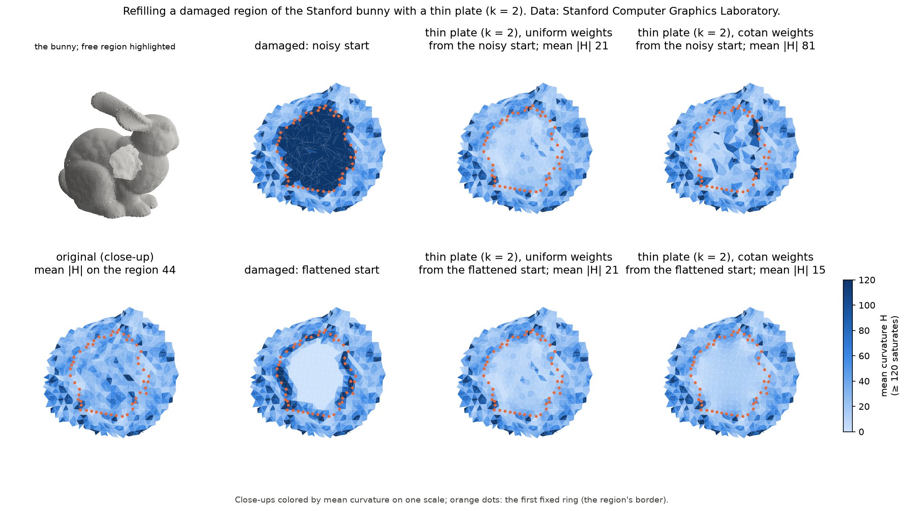
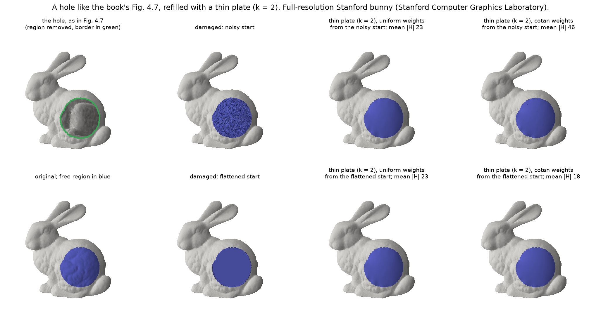

# Phase 5 — Real mesh and docs

## #14 Bunny hole filling

**Theory → code.** The book names hole filling as an application of fairing: smooth patches fill holes (§4.3, Fig. 4.7 right), computed with the thin-plate equation **Δ²x = 0** (p. 61, which points to Ch. 8). With k = 2, fixing two rings of vertices around the region gives approximately C¹ continuity at its border (p. 60, #11). Nothing new is needed in the solver: `solve_fair(V, F, free, 2, laplacian)`.

**Data.** The Stanford Bunny, from the Stanford 3D Scanning Repository (credit: Stanford Computer Graphics Laboratory). The repository allows research use and free redistribution with credit, but not commercial use. The mesh is downloaded into the git-ignored `data/` folder (README, "The Stanford bunny") and never committed. We use the decimated reconstruction `bun_zipper_res2.ply`: 8146 used vertices, 16301 triangles.

| Step | Code |
|---|---|
| read a PLY into plain V, F (drop unused vertices) | `load_mesh`, `fairing/mesh.py:234` |
| find non-manifold and boundary edges | `edge_face_counts`, `fairing/mesh.py:290` |
| damage by flattening onto the border's plane | `flatten_onto_border_plane`, `fairing/mesh.py:346` |
| region, damages, refills, figure | `examples/05_bunny.py` |

**Choosing the region: the mesh has problems.** The archive's README warns that the decimated versions were made with a crude algorithm that may not preserve the mesh's topology. Indeed, `bun_zipper_res2` has 342 vertices on problem edges: *non-manifold* edges, shared by more than two triangles, where one-rings and cotangent weights are not defined as in the book, and boundary edges (holes at the bottom). The full-resolution mesh is manifold, but much denser. Since the free vertices' equations reach only k rings beyond the region plus the triangles around them (#9), the region only has to stay **at least k + 1 = 3 rings** away from the problem edges. The example picks the vertex farthest from them (11 rings away) and frees its **6-ring**: 158 vertices, about 3 cm across on a 15 cm bunny, at least 5 rings from any problem edge, on the bunny's side near the front leg. A test checks this clearance when the bunny is present.

**Damage, two kinds** (mean edge length 0.0030):
- *noise:* Gaussian noise with σ = half an edge on the free vertices;
- *flatten:* the free vertices projected onto the least-squares plane of the region's border (its first fixed ring), a crude patch.

**Refill:** k = 2 with **cotangent weights frozen from the damaged input** (the book's linear method) and with **uniform weights**.

| refill (k = 2) | max distance to the original | mean \|H\| on the region |
|---|---|---|
| (original, for reference) | — | 44 |
| uniform, from the noisy start | 0.0028 | 21 |
| uniform, from the flattened start | 0.0028 (identical: difference exactly 0) | 21 |
| cotangent, from the noisy start | 0.0037 | **81** |
| cotangent, from the flattened start | **0.0012** | **15** |

The two cotangent refills differ by up to 0.0038, more than an edge.

What this shows, with #10–#12 behind it:
- **Uniform weights ignore the start.** The free vertices' starting positions enter `solve_fair` only through the weights, so both damages give exactly the same uniform refill.
- **Cotangent weights inherit the start.** From the noisy start, the weights are frozen from a crumpled surface (noise of half an edge), and the refill is rough: mean |H| 81, worse than the original. From the flattened start, a clean surface, it is the smoothest refill and the closest to the original.
- **A thin plate is smooth by design.** All good refills have a lower mean curvature than the original (15–21 vs 44): the original has scan detail, and the thin plate replaces it with the smoothest surface that fits the border. Refilling does not "restore" lost detail.

Tests (`tests/test_fairing.py`, `tests/test_mesh.py`). A sphere stands in for the bunny, so CI does not need the download:
- the uniform refill is identical from a noisy and from a flattened start;
- the cotangent refills differ, and the one from the flattened start is closer to the sphere;
- `edge_face_counts` detects boundary and non-manifold edges, `load_mesh` drops unused vertices, and `flatten_onto_border_plane` makes the free vertices coplanar without moving the fixed ones;
- the bunny region's clearance from problem edges, run only when the bunny is downloaded.
- the Fig. 4.7-like region (below) is a disk at least k + 1 rings from the full-resolution bunny's boundary edges, run only when the bunny is downloaded.

**What the figures show.**

`docs/img/14-bunny-before-after.png`. Top left: the bunny, with the region highlighted. The other panels are close-ups colored by mean curvature on one scale; orange dots mark the region's border (the first fixed ring).
- Bottom left, the original: scan detail everywhere (mean |H| 44).
- Second column, the damaged inputs: noise (dark, very high curvature) and the flattened patch (pale inside, with dark creases where it meets the border).
- Third column, uniform refills: identical in both rows, smooth.
- Fourth column, cotangent refills: rough with dark spikes from the noisy start (81), the smoothest from the flattened start (15).

To explore it in 3D:
- `examples/05_polyscope_bunny_explorer.py` is an **interactive explorer**. One bunny, with the camera on the region, and a panel to change the region's size (rings), the damage (none, noise with its level, flatten), the order k (1, 2, 3) and the weights (uniform, cotangent). Each change re-solves at once. The panel shows the clearance from problem edges (with a warning when the region gets too close), the mean |H| of the original, the start and the result, and the distance to the original. A transparent ghost of the original can be overlaid.
- `examples/05_polyscope_bunny.py` shows the original, the damaged inputs and all four refills side by side.
- The README has a short snippet.

### A hole like the book's (Fig. 4.7)

The region above is small (a 6-ring, 158 vertices) because the decimated bunny has no room for more. The book's Fig. 4.7 (right) shows a much larger hole on the haunch, filled with a smooth patch. To compare with it, `examples/05_bunny_book_region.py` frees a similar region on the **full-resolution** `bun_zipper.ply`, from the same download: 34834 used vertices, 69451 triangles, mean edge 0.0015. On the decimated mesh, the same region would contain 7 non-manifold edges and would not be a disk. The full mesh has no non-manifold edges, and its boundary edges (the holes in its base) are at least 21 rings from the region.

**What the book gives, and what we chose.** The figure's caption says only that fairing fills holes with smooth patches, and p. 61 points to the thin-plate equation Δ²x = 0 for hole filling (Ch. 8). The book does not give the hole's exact position, the weights, or how the hole is initialized, so:
- *Region* (`book_region`): the vertices within a distance 0.035 of a haunch vertex (the one closest to a point picked by eye from the figure), keeping the connected piece that contains it. That gives 2660 vertices, forming a disk (Euler characteristic 1).
- *Camera:* matplotlib's `view_init(15, -60)`, matched by eye to the figure (head left, haunch right).
- *Damage and refill:* as above, noise (σ = half an edge) or flattening, then k = 2 with uniform or cotangent weights.
- *Our hole keeps its triangles.* We discard the free vertices' positions but keep the original connectivity. A real hole has no vertices inside, so filling it first needs a triangulation of the hole, which is the topic of Ch. 8. Here we test only the fairing step.

| refill (k = 2) | max distance to the original | mean \|H\| on the region |
|---|---|---|
| (original, for reference) | — | 63 |
| uniform, from the noisy start | 0.0040 | 23 |
| uniform, from the flattened start | 0.0040 (identical: difference exactly 0) | 23 |
| cotangent, from the noisy start | 0.0035 | **46** |
| cotangent, from the flattened start | 0.0039 | **18** |

The two cotangent refills differ by up to 0.0045 (3 edges). The original's 63 cannot be compared with the 44 of the small region: the haunch is bumpier (62 there on the decimated mesh too), and curvature values also change with the mesh's resolution.

What the comparison shows:
- **The same picture as the book.** From the flattened start, both refills are smooth patches that blend into the haunch, like the book's right image. The scan bumps inside the hole are gone: as above, a thin plate does not restore lost detail.
- **The conclusions of the small region hold at this size.** Uniform weights ignore the start (difference exactly 0). Cotangent weights inherit it: the refill is rougher from the noisy start (46, with a few dark specks) and the smoothest from the flattened start (18).
- **The distance to the original no longer separates the refills.** All are 0.0035–0.0040 from the original (2–3 edges). On a hole this large, that distance comes from the thin plate replacing the haunch's own shape, not from the weights.

`docs/img/14-bunny-book-region.png`, laid out like the first figure, but every panel shows the whole bunny at the book's angle, lit, with the free region in blue (no curvature colors).
- Top left, the hole as in Fig. 4.7: the region's triangles removed and its border in green. The inside of the bunny shows through.
- Bottom left, the original, with the free region in blue.
- Second column, the damaged inputs (noise on top, flattened below).
- Third and fourth columns, the uniform and cotangent refills from each start. The dark specks of the cotangent refill from the noisy start are visible top right.

`examples/05_polyscope_bunny_book.py` opens the same bunny in polyscope, from the book's angle. By default it shows the refill in plain gray with the green border, as in the book. A panel switches between the hole, the damaged input, the refill and the original; changes the radius (0.015–0.045, always a disk), the damage, the order k and the weights; and colors by the free region or by mean curvature.

**Pitfalls.**
- *Check the mesh before trusting the operators.* Real data can be non-manifold, especially after decimation. Our `boundary_vertices` counts an edge as interior unless exactly one triangle uses it, so a non-manifold edge would silently pass. `edge_face_counts` makes the problem visible, and keeping k + 1 rings away from it makes it irrelevant for the solve.
- *The start matters for cotangent weights.* With the book's linear method, how the region is initialized decides the result when the weights are cotangent: a crude but clean patch (flattening) works far better than a noisy one. Uniform weights avoid the question, at the price of sampling artifacts on irregular meshes (#12); on this region they gave a smooth result.
- *File orientation.* The bunny files are y-up; the example rotates them to z-up for matplotlib's 3D axes.

## #15 Final documentation

**Theory → code.** No new equations or code in the library. The README now tells the story of the five phases in the book's order, and each step points to its note:
- one matrix, L = D·M (App. A.1), uniform (Eq. 3.10) or cotangent (Eq. 3.11), tested against Δx = −2H·n (Eq. 3.7): phase 2;
- smoothing as a flow, ∂x/∂t = λΔx (Eq. 4.5–4.6), explicit or implicit: phase 3;
- fairing, Lᵏx = 0 on the free vertices (§4.3), solved as the SPD system of Eq. A.2 with sparse Cholesky (§A.4), with C^(k−1) joints (Fig. 4.8), as the limit of the flow (p. 61), and for hole filling (Fig. 4.7): phases 4 and 5.

The README also has the install steps, a quick start, a table of the library's functions, a table of which script makes which figure, and a gallery of all 21 figures. `tests/test_docs.py` keeps it honest:

| Check | Test |
|---|---|
| every figure is written by an example script that the README lists, and shown in the README and in a phase note | `test_every_figure_is_made_by_a_listed_example_and_shown` |
| relative links and images in the README and the notes point to existing files | `test_relative_links_point_to_existing_files` |
| the README's quick-start code runs | `test_readme_quick_start_runs` |

**Reproducing the figures.** The six scripts were run from a clean clone of `main`, with the bunny copied from the existing download. All 21 PNGs came out byte-identical to the committed ones, in about 15 seconds. The README lists the library versions used.

**Review of the notes.** Every equation number was checked against the book, and every code citation against the line it points to, including the 20 (of 52) that `test_docs.py` does not check: line ranges (`smoothing.py:58–60`<!-- spla.eigsh( -->) and citations without a function name (`laplacian.py:37`<!-- W = adjacency(F, n) -->). All pointed to the intended statements. The fixes were about wording and stale references:
- *Cholesky notation.* §A.4 writes A = LLᵀ, where L is the triangular factor, not the Laplace matrix. Phase 4 now says so; the code comment uses RᵀR.
- *What the book says, and what we derived.* The book says only that implicit integration should be used for large time steps (§4.2). "Unconditionally stable for any h" is our derivation in #8, and the notes and README now say so. Likewise, Fig. 4.8's caption says that k sets the *maximum* smoothness C^(k−1), and p. 60–61 states the flow claims for the kth-order flow ∂x/∂t = Δᵏx, which #13 tests for k = 1.
- *A gap filled.* §A.6 (Table A.1) compares SuperLU, the LU behind SciPy's `factorized`, with a sparse Cholesky solver. Phase 4's "Solver choice" now cites it.
- *Stale forward references,* written before later issues existed (for example, "the bunny (#14) must be checked"), now point to what was actually done. The moonshot M1 (#16) is described as optional and not implemented.

**What the figures show.** No new figure: the README gallery shows the 21 existing ones, each with one sentence and the issue whose note explains it.

**Pitfalls.**
- *A citation test only checks what it can parse.* `test_docs.py` checks citations of the form `function`, `file.py:N`, and only that N lies inside the function. A line inside the right function but on the wrong statement passes, and citations without a function name are skipped. #33 (below) closes this gap.
- *Write what the book says, not what we proved.* Several sentences sounded like quotes of the book but were our own results. Checking each claim against the book's wording found them.

## #33 Stricter citation test (follow-up to #15)

**Theory → code.** No book equation. The "Theory → code" tables are only useful if each line number points at the statement that implements the equation. The old test checked a proxy, "line N lies inside the cited function", which stays true when lines shift *within* the function. That is the most common way line numbers go stale. The new test checks the property itself. Each citation names its statement in a hidden HTML comment right after it, which GitHub does not render:

  `` `fairing/fairing.py:33`<!-- A = A @ D @ M --> ``

| Rule | Test |
|---|---|
| the named statement is on the cited line, or in the cited range `N–M`; otherwise the message gives the line it is on now | `test_cited_lines_contain_their_statement` |
| a citation without a statement fails, unless it cites a function's own `def` line right after the function's backticked name | `test_cited_lines_contain_their_statement` |
| the short form `:N` refers to the file cited just before it on the same line | `line_citations`, `tests/test_docs.py` |
| the notes contain at least 40 line citations, so a broken pattern cannot silently check nothing | `test_notes_contain_line_citations` |

All 54 citations that the notes had before this issue are now checked: 23 cite a `def` line, and 31 name their statement, including the 20 that the old test skipped. The two examples in this section are checked too. The old check, that a cited line lies inside its function, stays as a second test.

**When the test fails.** If code moves, the message says, for example, `` `rhs = -(A_fc @ V[~free])` is not there; it is now on line 72 ``. Update the line number in the note; the statement stays the same. To check the test, we inserted one line at the start of `solve_fair`'s body. The new test flagged all five citations below it with their new lines, while the old function-span test still passed.

**What the figures show.** No figure.

**Pitfalls.**
- *A comment line is not a statement.* The phase-2 citation of line 82 of `laplacian.py` pointed at the comment "duplicate (i, j) entries are summed". The summing happens in the next statement, the conversion from COO to CSR. The citation now covers lines 82–84 and names `sp.coo_matrix(`.
- *A range pins only one statement.* `smoothing.py:58–60`<!-- spla.eigsh( --> names the `eigsh` call in phase 3's text and the `return` line in its table. If lines are inserted inside the range, the named statement may still be within it, so keep ranges short.
- *Even examples are checked.* While this section was being written, the test flagged two citations in it that named no statement. A line number that is only mentioned, not cited, is written without backticks.
- *The comment must survive Markdown.* A statement containing `|` would split a table cell, and `-->` would end the comment early. None of ours does; pick another part of the line if one ever does.
